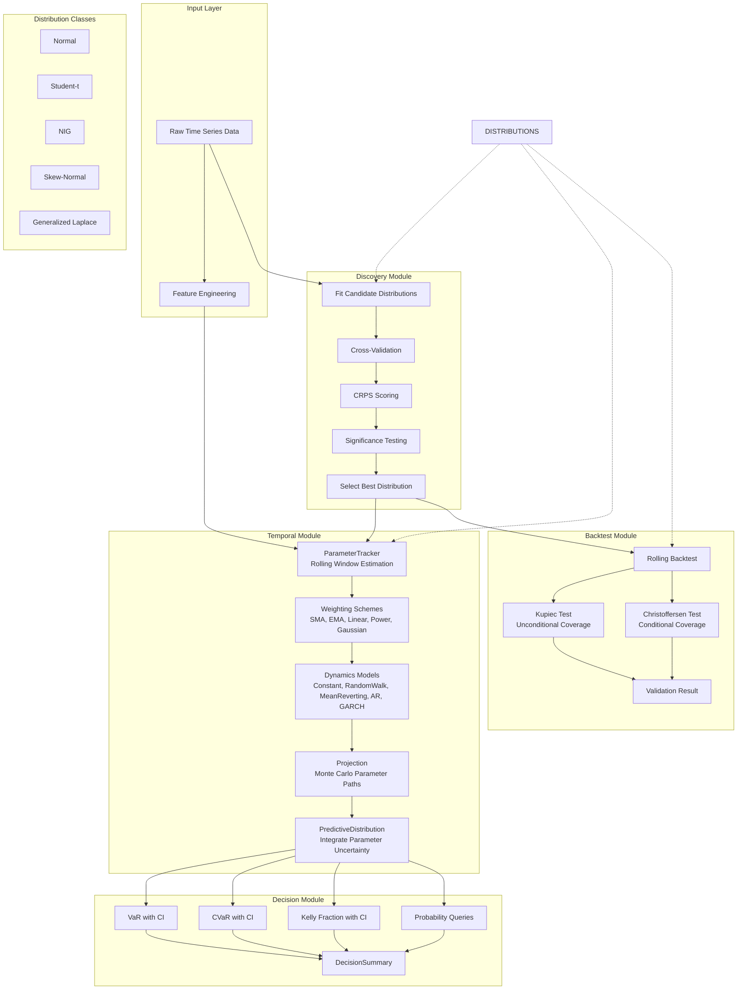
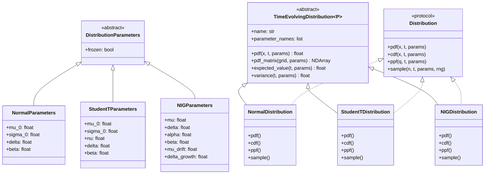
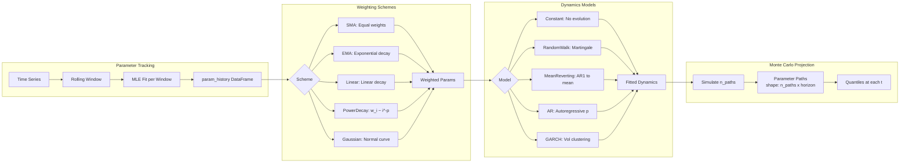
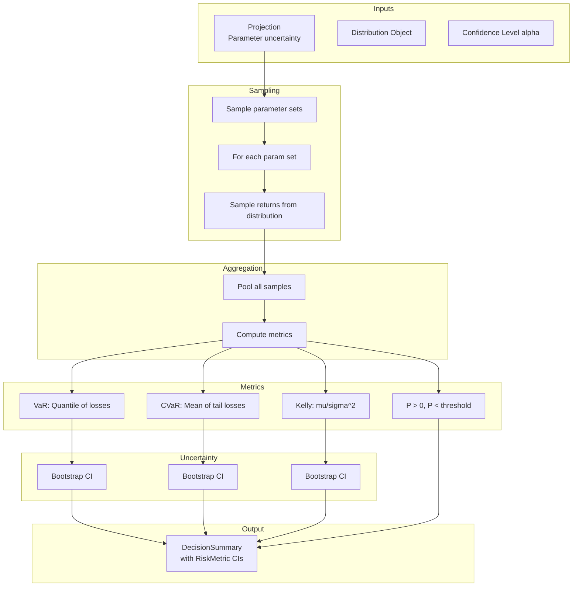
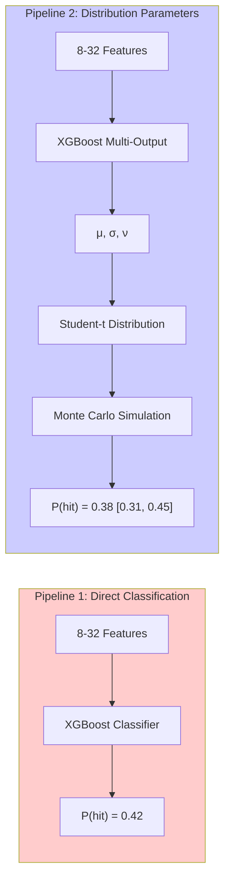
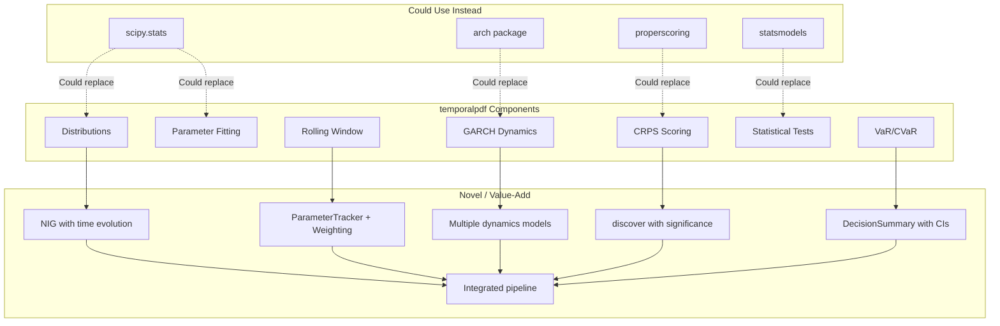
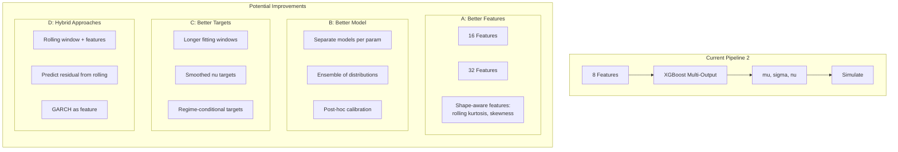

# temporalpdf Architecture, Comparisons, and Improvements

## 1. Full Library Architecture

### 1.1 High-Level Pipeline



### 1.2 Distribution Class Hierarchy



### 1.3 Temporal Module Detail



### 1.4 Decision Flow



---

## 2. Pipeline 1 vs Pipeline 2: The Core Comparison



**Both pipelines use XGBoost.** The difference:
- P1: XGBoost predicts the target directly
- P2: XGBoost predicts distribution parameters, then we simulate

---

## 3. Comparison to Existing Libraries

### 3.1 Feature Comparison Matrix

| Feature | temporalpdf | XGBoost/sklearn | scipy.stats | arch | statsmodels | properscoring |
|---------|-------------|-----------------|-------------|------|-------------|---------------|
| **Classification** | Uses sklearn | Native | - | - | - | - |
| **Multi-output Regression** | Uses sklearn | Native | - | - | - | - |
| **Distribution Fitting** | MLE for NIG, t, Normal | - | Native (100+ dists) | - | Some | - |
| **Heavy-tailed (NIG)** | Native | - | Via subclassing | - | - | - |
| **Rolling Window Params** | ParameterTracker | - | Manual | - | Rolling OLS | - |
| **Weighting Schemes** | 6 built-in | Manual | - | EWMA only | - | - |
| **Parameter Dynamics** | 5 models | - | GARCH only | AR/ARIMA | - | - |
| **Monte Carlo Projection** | Native | Manual | Simulation | - | - | - |
| **CRPS Scoring** | Native | - | - | - | Native | - |
| **Distribution Selection** | discover() with CV | - | - | - | - | Cross-val |
| **VaR/CVaR** | Native with CI | Manual | Native | - | - | - |
| **Kelly Criterion** | Native with CI | - | - | - | - | - |
| **Kupiec Test** | Native | - | - | kupiec_pof | - | - |
| **Christoffersen Test** | Native | - | - | Limited | - | - |
| **Calibration Curves** | Use sklearn | - | - | - | - | Native |
| **Multi-output Regression** | Use sklearn | - | - | - | - | Native |

### 2.2 What temporalpdf Replaces/Wraps



### 2.3 Key Differentiators

| What's Novel | Why It Matters |
|--------------|----------------|
| **Integrated discover() → TemporalModel → decision() pipeline** | No other library offers this end-to-end flow |
| **Parameter dynamics (not just GARCH)** | Mean-reverting, AR, RandomWalk options |
| **DecisionSummary with confidence intervals** | Uncertainty-aware risk metrics |
| **Distribution selection with significance testing** | Know if your choice is statistically justified |
| **Time-evolving distributions** | Built-in support for parameters that change over forecast horizon |

---

## 3. Pipeline 2 Improvement Analysis

### 3.1 Current Weaknesses

From the V3 showcase results:

| Parameter | Prediction Correlation | Issue |
|-----------|----------------------|-------|
| sigma_0 (volatility) | 0.572 | Decent - volatility is predictable |
| mu_0 (location) | 0.113 | Poor - mean is hard to predict |
| nu (degrees of freedom) | 0.066 | Very poor - tail shape is hard to predict |

**Root causes:**
1. **Features don't capture distribution shape** - 8 features mostly capture level/volatility
2. **Student-t nu is noisy on small windows** - 10-day window → unstable nu estimates
3. **No regime awareness** - same model for all market conditions

### 3.2 Improvement Ideas



### 3.3 Specific Experiments to Run

| Experiment | Hypothesis | What Changes |
|------------|------------|--------------|
| **More features (16, 32)** | More predictive power for shape params | Add: rolling kurtosis, skewness, autocorrelation, GARCH vol |
| **Longer horizons (15, 20, 30d)** | Distribution approach shines at longer horizons | HORIZON parameter |
| **Lower barrier (3%)** | Easier target, more hits in sample | BARRIER parameter |
| **Higher barrier (5%, 7%)** | Harder target, tests tail modeling | BARRIER parameter |
| **Separate models per param** | Specialized feature sets | 3 XGBoost models instead of MultiOutput |
| **Smooth nu targets** | Reduce noise in tail parameter | Rolling average of fitted nu |
| **Rolling + residual** | Best of both worlds | P2 predicts adjustment to rolling estimate |
| **Regime switching** | Different models for high/low vol | Separate training by volatility regime |

### 3.4 Feature Engineering Ideas

**Current 8 features:**
```python
features = [
    np.mean(window),           # 1. Mean return
    np.std(window),            # 2. Volatility
    window[-1],                # 3. Yesterday's return
    window[-2],                # 4. Day before yesterday
    np.min(window),            # 5. Min return
    np.max(window),            # 6. Max return
    np.sum(window > 0) / n,    # 7. Positive day ratio
    np.max(window) - np.min(window),  # 8. Range
]
```

**Proposed 32 features:**
```python
features_32 = [
    # Original 8
    np.mean(window), np.std(window), window[-1], window[-2],
    np.min(window), np.max(window), np.sum(window > 0) / n,
    np.max(window) - np.min(window),

    # Shape features (9-12)
    scipy.stats.skew(window),           # Skewness
    scipy.stats.kurtosis(window),       # Kurtosis (tail heaviness!)
    np.percentile(window, 5),           # 5th percentile
    np.percentile(window, 95),          # 95th percentile

    # Volatility features (13-16)
    np.std(window[:10]),                # First half vol
    np.std(window[10:]),                # Second half vol
    np.std(window[10:]) / np.std(window[:10]),  # Vol ratio
    np.abs(window).mean(),              # Mean absolute return

    # Trend features (17-20)
    window[-5:].mean() - window[:5].mean(),  # Momentum
    np.corrcoef(np.arange(n), window)[0,1],  # Trend strength
    (window > window.mean()).sum() / n,      # Above mean ratio
    window[-1] - window[0],                  # Period return

    # Autocorrelation (21-24)
    np.corrcoef(window[:-1], window[1:])[0,1],   # Lag-1 autocorr
    np.corrcoef(window[:-2], window[2:])[0,1],   # Lag-2 autocorr
    np.corrcoef(window[:-5], window[5:])[0,1],   # Lag-5 autocorr
    np.abs(np.corrcoef(window[:-1], window[1:])[0,1]),  # Abs autocorr

    # Tail features (25-28)
    (window < np.percentile(window, 10)).sum(),  # Tail events (low)
    (window > np.percentile(window, 90)).sum(),  # Tail events (high)
    np.abs(window).max(),                        # Max abs return
    (np.abs(window) > 2 * np.std(window)).sum(), # Outlier count

    # Cross-sectional (29-32)
    window[-3:].mean(),                 # Last 3 days mean
    window[-3:].std(),                  # Last 3 days vol
    window[-1] / np.std(window),        # Standardized last return
    (window[-1] - np.mean(window)) / np.std(window),  # Z-score
]
```

### 3.5 Why XGBoost Might Not Be Optimal

**Issue:** XGBoost predicts each output independently (even in MultiOutput wrapper).

**Alternative approaches:**
1. **Neural network with shared layers** - Learn common representations
2. **Gaussian Process** - Natural uncertainty quantification
3. **Quantile regression** - Directly predict distribution quantiles
4. **Copula models** - Model parameter dependencies

---

## 4. Test Matrix

### 4.1 Configurations to Test

| Dimension | Values to Test |
|-----------|----------------|
| Barrier | 2%, 3%, 5%, 7% |
| Horizon | 5, 10, 15, 20, 30 days |
| Features | 8, 16, 32 |
| Distribution | Normal, Student-t, NIG |

**Full matrix:** 4 x 5 x 3 x 3 = 180 combinations

**Prioritized subset:** Focus on meaningful comparisons
- Barrier: 3%, 5%
- Horizon: 10, 20 days
- Features: 8, 32
- Distribution: Best from discovery

= 2 x 2 x 2 x 1 = 8 combinations per run

### 4.2 Metrics to Track

```python
metrics = {
    'brier_p1': ...,
    'brier_p2': ...,
    'brier_diff': ...,  # P2 - P1 (negative = P2 wins)
    'calibration_error_p1': ...,
    'calibration_error_p2': ...,
    'prediction_std_p1': ...,
    'prediction_std_p2': ...,
    'param_corr_mu': ...,
    'param_corr_sigma': ...,
    'param_corr_nu': ...,
    'high_vol_error_p1': ...,
    'high_vol_error_p2': ...,
    'low_vol_error_p1': ...,
    'low_vol_error_p2': ...,
}
```

---

## 5. Summary

### What temporalpdf Does Well
1. **Integrated pipeline** from data to decision with uncertainty
2. **Multiple dynamics models** beyond just GARCH
3. **Statistical validation** with proper tests (Kupiec, Christoffersen)
4. **Distribution selection** with significance testing

### Where to Improve Pipeline 2
1. **Feature engineering** - Add shape-aware features (kurtosis, skewness)
2. **Target engineering** - Smooth nu estimates, use longer windows
3. **Model architecture** - Consider separate models per parameter
4. **Hybrid approach** - Combine rolling window baseline with feature-based adjustments

### Key Experiments
1. More features (32 vs 8)
2. Different horizons (5, 10, 15, 20, 30 days)
3. Different barrier levels (2%, 3%, 5%, 7%)
4. Regime-conditional models
