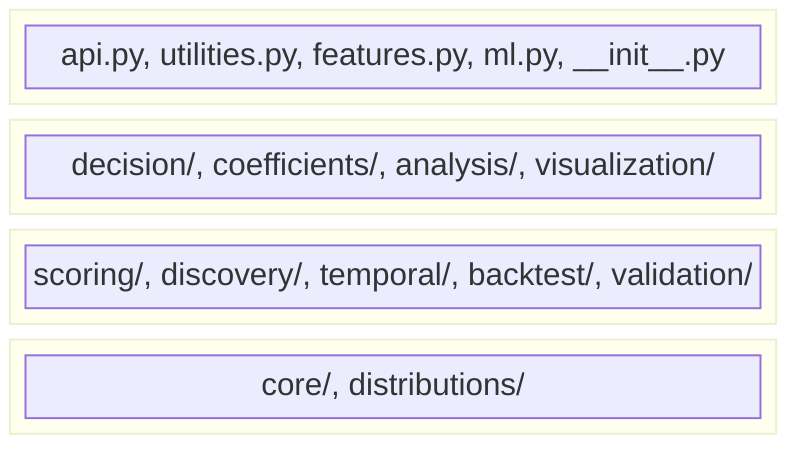
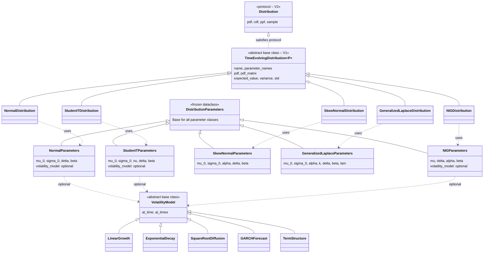
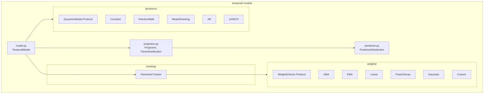
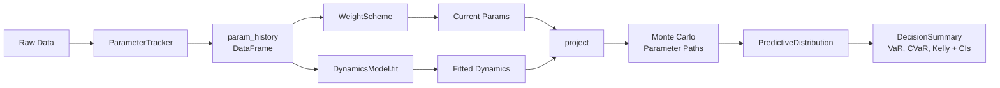
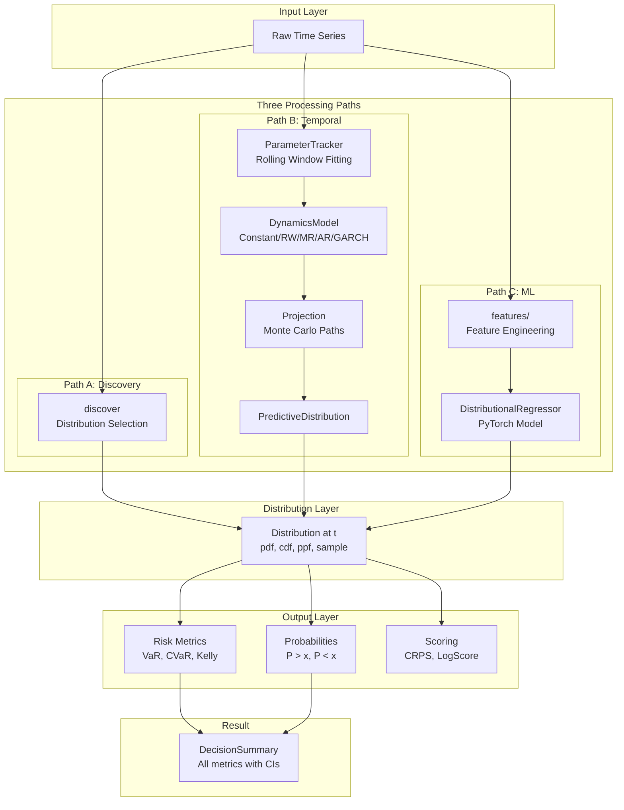
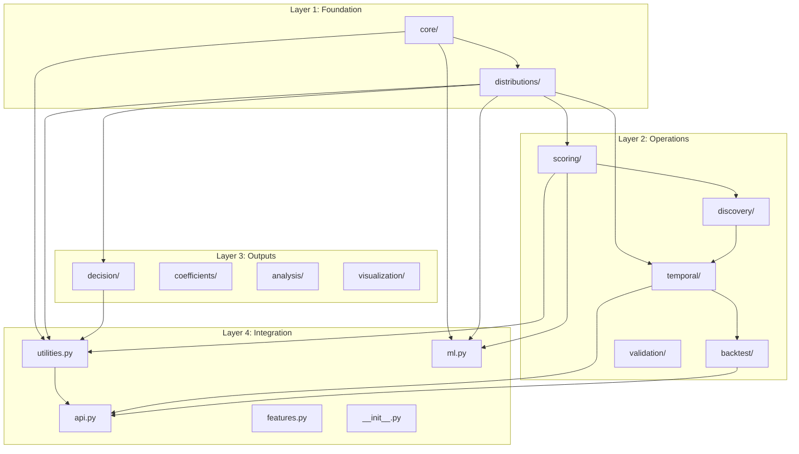

# temporalpdf Architecture

This document maps the complete architecture of temporalpdf, showing what each module does, why it exists, and how modules connect to each other.

---

## Overview

**Total structure:** 50 Python files across 10 submodules + 4 root-level files.

```
src/temporalpdf/
├── __init__.py          # Main exports (140+ symbols)
├── api.py               # High-level facade functions
├── features.py          # Feature extraction for ML
├── ml.py                # PyTorch distributional regression
├── utilities.py         # Fitting, selection, comparison
│
├── core/                # Foundation: abstractions & containers
├── distributions/       # Foundation: concrete distributions
│
├── scoring/             # Evaluation: proper scoring rules
├── discovery/           # Evaluation: distribution selection
├── temporal/            # Modeling: time-evolving parameters
├── backtest/            # Validation: rolling backtests
├── validation/          # Validation: metrics & validators
│
├── decision/            # Output: risk metrics & sizing
├── coefficients/        # Output: rolling coefficient extraction
├── analysis/            # Output: time series decomposition
└── visualization/       # Output: plotting
```

---

## Layer Architecture

The library follows a **four-layer architecture**:



**Why this structure?** The layers enforce a dependency rule: **lower layers never import from higher layers.** `core/` and `distributions/` know nothing about `scoring/`, `temporal/`, or `decision/`. This means you can use distributions without the temporal pipeline, scoring rules without the decision module, or decision utilities without backtesting. `api.py` and `utilities.py` sit at the top because they orchestrate everything below. If a lower layer imported a higher one, you couldn't use the foundation without pulling in the entire library.

---

## Layer 1: Foundation

### core/ — Base definitions and containers

**Purpose:** Define the contracts that all distributions must follow, plus shared containers for results.

| File | Contents | Description | Why It Exists |
|------|----------|-------------|---------------|
| `distribution.py` | `DistributionParameters`, `Distribution`, `TimeEvolvingDistribution` | `DistributionParameters` is the base dataclass that all parameter classes inherit from (ensures immutability via `frozen=True`). `Distribution` is a **protocol** — a contract specifying which methods a class must have; any class with `pdf`, `cdf`, `ppf`, `sample` methods qualifies automatically. `TimeEvolvingDistribution` is an **abstract base class** — a template that distributions inherit from and fill in; it adds `pdf_matrix` (evaluate the density over a full time × value grid), plus `expected_value` and `variance` helpers. | The protocol is the newer, minimal interface (referred to as "V2" in code comments — introduced when the codebase was refactored). The abstract base class is the original, fuller interface ("V1"). Both exist because V1 distributions still work, but new code only needs to satisfy the simpler V2 protocol. See [V1 vs V2 rationale](#why-v1-and-v2-coexist) below. |
| `parameters.py` | `NormalParameters`, `StudentTParameters`, `SkewNormalParameters`, `GeneralizedLaplaceParameters` | Frozen (immutable) dataclasses holding the numbers that define each distribution. Common fields: `mu_0` (initial mean), `sigma_0` (initial volatility), `delta` (mean drift rate), `beta` (volatility growth rate). Each distribution type adds its own fields (e.g. Student-t adds `nu` for degrees of freedom). | Every distribution needs its parameters passed around as a single object. They are frozen (`@dataclass(frozen=True)`) to prevent accidental mutation — in a pipeline where the same parameter object passes through fitting, scoring, decision, and visualization, mutability would create hard-to-trace bugs where one stage silently corrupts another's inputs. |
| `grid.py` | `EvaluationGrid` | Defines the value axis (x-values) and time axis (t-values) over which to evaluate a distribution's probability density. Creates the 2D mesh needed for surface plots and heatmaps. | Without a shared grid object, every function that evaluates a distribution over time would independently define its own axes and ranges. |
| `result.py` | `RiskMetric`, `DecisionSummary`, `PDFResult`, `ValidationResult` | `RiskMetric` wraps a single number (e.g. VaR = 4%) with its confidence interval and standard error. `DecisionSummary` bundles all decision outputs (VaR, CVaR, Kelly fraction, probability of profit). `PDFResult` holds the evaluated probability density matrix plus metadata. `ValidationResult` holds accuracy metrics (log-likelihood, MAE, MSE, R²). | Returning structured objects instead of raw floats means confidence intervals travel with their point estimates, and downstream code always knows what it's working with. |
| `volatility.py` | `VolatilityModel` (abstract base class) + 5 implementations | Defines how volatility changes as the forecast horizon increases. The base class requires an `at_time(sigma_0, t)` method that returns σ at time t. Five concrete models implement different evolution patterns (see table below). | Without this, volatility is static or grows linearly. Real volatility mean-reverts, clusters, and follows term structures — these models capture that. Volatility models live in `core/` (not `temporal/`) because they describe how σ evolves **within a single forecast** — a property of the distribution's parameters. The `temporal/` module does something different: it tracks how **fitted parameters themselves** change across many rolling windows over historical time. |

#### Distribution and Volatility Model Interfaces

These are the exact contracts defined in `core/`. Any class implementing these methods can be used in place of the built-in implementations.

**Distribution protocol (V2 — minimal interface).** Any class with these four methods is a valid distribution:

```python
class Distribution(Protocol):
    def pdf(self, x, t, params) -> ArrayLike:    # Probability density at values x, at time t
    def cdf(self, x, t, params) -> ArrayLike:    # Cumulative probability at values x, at time t
    def ppf(self, q, t, params) -> ArrayLike:    # Quantile function (inverse CDF)
    def sample(self, n, t, params) -> ArrayLike: # Draw n random samples at time t
```

**TimeEvolvingDistribution (V1 — abstract base class).** Distributions inheriting from this must implement everything above **plus**:

```python
class TimeEvolvingDistribution(ABC, Generic[P]):
    name: str                                     # e.g. "Normal Inverse Gaussian"
    parameter_names: tuple[str, ...]              # e.g. ("mu", "delta", "alpha", "beta")
    def pdf_matrix(self, x, time_grid, params)    # Evaluate over full time × value grid
    # Default implementations (numerical integration), can be overridden:
    def expected_value(self, x, t, params) -> float
    def variance(self, x, t, params) -> float
    def std(self, x, t, params) -> float
```

<a id="why-v1-and-v2-coexist"></a>
> **Why V1 and V2 coexist:** The original API (V1) used a heavyweight abstract base class that required distributions to implement `pdf_matrix`, `name`, `parameter_names`, and more. This worked but made it harder to write new distributions or use distributions from external libraries. V2 introduced a minimal protocol — just `pdf`, `cdf`, `ppf`, `sample`. Any class with these methods works, without inheriting from anything. Both coexist because all five built-in distributions were written against V1, and rewriting them would gain nothing — V1 classes automatically satisfy V2 since they have all four required methods. New code should target V2.

**VolatilityModel (abstract base class):**

```python
class VolatilityModel(ABC):
    def at_time(self, sigma_0: float, t: float) -> float:   # σ at time t, given initial σ₀
    def at_times(self, sigma_0: float, t: ndarray) -> ndarray: # Vectorized version
```

#### Volatility Models (5 options)

| Model | Formula | Use Case |
|-------|---------|----------|
| `LinearGrowth` | σ(t) = σ₀ × (1 + rate × t) | Simple growth, short horizons |
| `ExponentialDecay` | σ(t) = σ_long + (σ₀ - σ_long) × e^(-κt) | Mean-reverting vol |
| `SquareRootDiffusion` | CIR process expected path | Term structure models |
| `GARCHForecast` | GARCH(1,1) forecast | Volatility clustering |
| `TermStructure` | Piecewise linear interpolation | External vol surface |

**Key insight:** Parameters can have an optional `volatility_model` attribute. This makes `sigma(t) = volatility_model.at_time(sigma_0, t)` instead of just `sigma_0 * (1 + beta * t)`.

### distributions/ — Concrete distribution implementations

**Purpose:** Each file implements one probability distribution that satisfies the `Distribution` protocol from `core/`. All distributions are registered in `DistributionRegistry`, which acts as a factory — given a name string like `"nig"`, it returns the corresponding distribution object.

#### Distribution Options (5 distributions)

| Distribution | Class | Tails | Skew | Parameters | Special Properties |
|--------------|-------|-------|------|------------|-------------------|
| **Normal** | `NormalDistribution` | Light | No | μ₀, σ₀, δ, β | Baseline, fast |
| **Student-t** | `StudentTDistribution` | Heavy | No | μ₀, σ₀, ν, δ, β | Fat tails via ν (degrees of freedom) |
| **Skew-Normal** | `SkewNormalDistribution` | Light | Yes | μ₀, σ₀, α, δ, β | Asymmetry via α |
| **Gen. Laplace** | `GeneralizedLaplaceDistribution` | Variable | Yes | μ₀, σ₀, α, k, δ, β, λ | k controls tail sharpness |
| **NIG** | `NIGDistribution` | Semi-heavy | Yes | μ, δ, α, β | **Closure under convolution** (see below) |

**NIG special property — closure under convolution:** If daily returns follow NIG, then the sum of N daily returns also follows NIG with known parameters (α and β stay the same; only location μ and scale δ add). This means multi-day forecasts become parameter arithmetic instead of Monte Carlo simulation. No other distribution in the library has this property. For distributions without closure (Normal, Student-t, Skew-Normal, Generalized Laplace), multi-day forecasts require Monte Carlo simulation (`barrier_prob_mc()`) or the `temporal/` module's `Projection`, which simulates parameter paths forward.

#### Class Hierarchy

This diagram shows what inherits from what, which classes satisfy which protocols, and how parameter classes map to distribution classes.



**Key points:**
- All five concrete distributions inherit from `TimeEvolvingDistribution` (V1), which means they **also** satisfy the `Distribution` protocol (V2) automatically.
- Each distribution class is paired with exactly one parameter class. The parameter class holds the numbers; the distribution class holds the math.
- `VolatilityModel` is an optional attachment on parameters — if present, it overrides how σ evolves with time. If absent, σ evolves using the default linear formula `σ₀ × (1 + β × t)`.

---

## Layer 2: Operations

### scoring/ — Proper scoring rules

**Purpose:** Evaluate how good a distributional prediction is. A **proper scoring rule** is a metric that is minimized when the predicted distribution matches the true distribution — it cannot be gamed by predicting something other than your best guess. Lower score = better prediction.

#### Scoring Rules (2 types)

| Score | Full Name | Function | Properties | When to Use |
|-------|-----------|----------|------------|-------------|
| **CRPS** | Continuous Ranked Probability Score | `crps()`, `crps_mc()`, `crps_normal()` | Measures the entire distribution's fit (global). Always finite. Rewards both calibration (correct on average) and sharpness (tight intervals). | Robust comparison between distributions |
| **Log Score** | Negative Log-Likelihood | `log_score()` | Measures density at the observed value only (local). Very sensitive to tail accuracy. Returns infinity if the observation falls where the distribution assigns zero density. | When tail accuracy matters most |

### discovery/ — Distribution selection

**Purpose:** Automatically find the best distribution for your data with statistical confidence.

| Component | What It Does |
|-----------|--------------|
| `discover()` | Main entry point. Cross-validates candidates, returns `DiscoveryResult`. |
| `DiscoveryResult` | Contains `best`, `confidence`, `scores`, `std_scores`. |
| `paired_t_test()` | Statistical significance between score distributions. |
| `determine_confidence()` | Maps p-value to human-readable confidence level. |

### temporal/ — Time-evolving parameter modeling

**Purpose:** Model how distribution parameters change over time. This is the **core modeling engine**.



#### Weighting Schemes (6 options)

Any class satisfying the `WeightScheme` protocol can be used:

```python
class WeightScheme(Protocol):
    def get_weights(self, n: int) -> NDArray:       # n weights summing to 1; index 0 = most recent
    def effective_sample_size(self, n: int) -> float # ESS = 1/Σ(wᵢ²); equal weights → n
```

| Scheme | Full Name | Formula | Use Case |
|--------|-----------|---------|----------|
| `SMA` | Simple Moving Average | Equal weights over window | Simple baseline |
| `EMA` | Exponential Moving Average | w_i = (1-α) × α^i | Recent data emphasis |
| `Linear` | — | w_i = max(window - i, 0) | Linear decay |
| `PowerDecay` | — | w_i = 1/(i+1)^p | Tunable decay speed |
| `Gaussian` | — | w_i = exp(-0.5 × (i/σ)²) | Smooth decay |
| `Custom` | — | User-defined function | Full flexibility |

#### Dynamics Models (5 options)

Any class satisfying the `DynamicsModel` protocol can be used:

```python
class DynamicsModel(Protocol):
    def fit(self, param_series: NDArray) -> "DynamicsModel":  # Fit to history; returns self
    def project(self, current_value, horizon, n_paths=1000) -> NDArray:  # (n_paths, horizon)
    def summary(self) -> dict[str, float]:                    # Fitted model parameters
```

| Model | Formula | Fitted Parameters | Use Case |
|-------|---------|-------------------|----------|
| `Constant` | θ(t) = θ_long_run | long_run_value | Stable parameters |
| `RandomWalk` | θ(t+1) = θ(t) + drift + σε | drift, sigma | Non-stationary |
| `MeanReverting` | dθ = κ(θ_long - θ)dt + σdW | kappa, long_run, sigma | Volatility mean-reversion |
| `AR` (Autoregressive) | θ(t) = c + Σφᵢ·θ(t-i) + σε | order, coefficients, sigma | Autocorrelated params |
| `GARCH` (Generalized Autoregressive Conditional Heteroskedasticity) | σ²(t) = ω + α·ε²(t-1) + β·σ²(t-1) | omega, alpha, beta | Volatility clustering |

#### The Temporal Pipeline



### backtest/ — Rolling Value at Risk backtesting

**Purpose:** Validate models against historical data with proper statistical tests.

#### Backtest Components

| Component | What It Does |
|-----------|--------------|
| `Backtest` | Runs rolling window VaR forecast vs realized returns. |
| `BacktestResult` | Contains breaches, expected vs actual breach rate, test results. |

#### Statistical Tests (2 tests)

| Test | Tests For | Null Hypothesis |
|------|-----------|-----------------|
| `kupiec_test()` | Unconditional coverage | Breach rate = α |
| `christoffersen_test()` | Conditional coverage | Breaches are independent |

### validation/ — General validation metrics

**Purpose:** Standard validation metrics for any predictive model.

| Function | What It Measures |
|----------|-----------------|
| `log_likelihood()` | Average log probability of observations |
| `mae()`, `mse()`, `rmse()` | Point prediction accuracy |
| `r_squared()` | Explained variance |
| `Validator`, `CrossValidator` | Wrapper classes for validation workflows |

---

## Layer 3: Outputs

### decision/ — Risk metrics and position sizing

**Purpose:** Convert distributions into actionable decisions.

#### Decision Functions (3 categories)

| Category | Functions | Output |
|----------|-----------|--------|
| **Risk Metrics** | `var()` (Value at Risk), `cvar()` (Conditional VaR / Expected Shortfall), plus `_with_ci` variants that return confidence intervals | Loss quantile / expected loss in tail |
| **Position Sizing** | `kelly_fraction()`, `fractional_kelly()`, `kelly_with_ci()` — Kelly criterion computes the mathematically optimal fraction of capital to bet | Optimal bet size (positive = go long, negative = go short) |
| **Probabilities** | `prob_greater_than()`, `prob_less_than()`, `prob_between()` | Probability that the outcome falls in a specified range |

**VaR sign convention:** `var()` returns a **positive** loss amount (e.g. 0.04 means "5% chance of losing more than 4%"). To compare against an actual return, negate: `actual_return < -var_value` means a breach occurred.

### coefficients/ — Rolling coefficient extraction

**Purpose:** Extract time-varying distribution coefficients from data windows.

| Function | Extracts |
|----------|----------|
| `calculate_mean()` | Rolling mean |
| `calculate_volatility()` | Rolling std |
| `calculate_skewness()` | Rolling skewness |
| `calculate_mean_rate()` | Mean drift rate |
| `calculate_volatility_growth()` | Vol growth rate |
| `RollingCoefficientExtractor` | All coefficients together |

### analysis/ — Time series decomposition

**Purpose:** Decompose time series into components (trend, seasonality, residual).

#### Decomposition Methods (6 options)

| Function | Method |
|----------|--------|
| `decompose_stl()` | STL (Seasonal-Trend decomposition using LOESS — a local regression smoother) |
| `decompose_stl_with_seasonality()` | STL with explicit seasonality period |
| `decompose_fourier()` | Fourier transform (frequency-domain decomposition) |
| `decompose_wavelet()` | Wavelet transform (time-frequency decomposition) |
| `decompose_moving_average()` | Simple moving average decomposition |
| `decompose_exponential_smoothing()` | Exponential smoothing (ETS — Error, Trend, Seasonal) |

### visualization/ — Plotting utilities

**Purpose:** Generate publication-quality plots of distributions and results.

#### Visualization Options

| Component | Capabilities |
|-----------|-------------|
| `PDFPlotter` | 3D surface plots, heatmaps, time slices |
| `InteractivePlotter` | Plotly interactive visualizations |
| **Styles** | `DEFAULT_STYLE`, `PUBLICATION_STYLE`, `PRESENTATION_STYLE`, `DARK_STYLE` |

---

## Layer 4: Integration

### utilities.py — Core fitting and comparison

**Size:** ~1000 lines. The workhorse module.

#### Utility Functions by Category

| Category | Functions | Count |
|----------|-----------|-------|
| **Fitting** | `fit()`, `fit_nig()`, `fit_student_t()`, `fit_normal()` | 4 |
| **Selection** | `select_best_distribution()`, `compare_distributions()` | 2 |
| **Backtesting** | `rolling_var_backtest()` | 1 |
| **Barrier Probability** | `barrier_prob_normal()`, `_student_t()`, `_nig()` (analytical), `_mc()` (Monte Carlo), `_importance_sampling()`, `_qmc()` (Quasi-Monte Carlo), `_temporal()` | 7 |
| **Comparison** | `compare_static_vs_temporal()` | 1 |
| **Conformal** | `ConformalPredictor` | 1 |

### features.py — Feature extraction for machine learning

**Purpose:** Extract features from data windows that predict distribution parameters. These are the inputs to `DistributionalRegressor`.

#### Calibration Features (12 features)

| Feature | Predicts | Formula/Method |
|---------|----------|----------------|
| `hill_estimator` | ν (tail index) | Hill estimator from k largest |
| `jarque_bera_stat` | Fat tails | JB = n/6 × (S² + K²/4) |
| `kurtosis` | ν | Excess kurtosis |
| `extreme_freq` | ν | Fraction beyond 2σ |
| `mean` | μ | Sample mean |
| `std` | σ | Sample std |
| `garch_proxy` | σ regime | Recent/overall variance ratio |
| `vol_regime` | σ regime | Recent/overall std ratio |
| `vol_clustering` | GARCH need | Autocorr of \|returns\| |
| `skewness` | β (NIG) | Sample skewness |
| `tail_asymmetry` | β (NIG) | Upper/lower tail ratio |
| `max_drawdown` | Risk | Maximum drawdown |

### ml.py — PyTorch distributional regression

**Purpose:** Train neural networks to predict distribution parameters directly from features. This is the machine learning path to distributional prediction — instead of fitting a distribution to historical data, you train a model that maps features to distribution parameters.

| Class | What It Does |
|-------|--------------|
| `DistributionalRegressor` | Neural network that outputs distribution parameters (μ, σ, ν). Trained using CRPS (Continuous Ranked Probability Score) as the loss function, which directly optimizes distributional accuracy. |
| `BarrierModel` | End-to-end differentiable model: features → distribution parameters → barrier probability. Because every step is differentiable, gradients flow from the final probability back through the distribution math to the network weights. |

---

## Data Flow Diagrams

### Complete Pipeline



### Module Dependencies



---

## Summary Tables

### All Options at Each Pipeline Stage

| Stage | # | Options Available | Module |
|-------|---|-------------------|--------|
| **Distribution** | 5 | Normal, Student-t, Skew-Normal, Generalized Laplace, NIG (Normal Inverse Gaussian) | `distributions/` |
| **Volatility Model** | 5 | LinearGrowth, ExponentialDecay, SquareRootDiffusion, GARCHForecast, TermStructure | `core/volatility.py` |
| **Weighting** | 6 | SMA (Simple Moving Avg), EMA (Exponential Moving Avg), Linear, PowerDecay, Gaussian, Custom | `temporal/weights/` |
| **Dynamics** | 5 | Constant, RandomWalk, MeanReverting, AR (Autoregressive), GARCH | `temporal/dynamics/` |
| **Scoring** | 4 | CRPS, CRPS Monte Carlo, CRPS Normal (analytical), Log Score | `scoring/` |
| **Risk/Decision** | 6 | VaR (Value at Risk), CVaR (Conditional VaR), Kelly fraction, prob_greater_than, prob_less_than, prob_between | `decision/` |
| **Decomposition** | 6 | STL (Seasonal-Trend LOESS), Fourier, Wavelet, Moving Average, Exponential Smoothing | `analysis/` |
| **Barrier Prob** | 7 | 3 analytical (Normal, Student-t, NIG) + Monte Carlo, Importance Sampling, Quasi-Monte Carlo, Temporal | `utilities.py` |
| **Backtest Tests** | 2 | Kupiec (unconditional coverage), Christoffersen (conditional coverage) | `backtest/` |
| **Plot Styles** | 4 | Default, Publication, Presentation, Dark | `visualization/` |
| **Features** | 12 | Calibration features for ML (see features.py section above) | `features.py` |

### Export Counts by Category

| Category | Count |
|----------|-------|
| Core abstractions | 10 |
| Volatility models | 9 (5 classes + 4 factories) |
| Distributions | 10 (5 full names + 5 aliases) |
| Scoring rules | 6 |
| Decision utilities | 12 |
| Coefficient extraction | 7 |
| Visualization | 6 |
| Validation | 6 |
| Analysis | 7 |
| Utilities | 16 |
| V2 Temporal | 14 |
| ML module | 3 |
| Feature extraction | 12 |
| **Total** | **~140** |

---

## API Versions (V1 and V2)

The codebase was refactored at one point, introducing a newer API style. Both coexist (see [rationale](#why-v1-and-v2-coexist) in the core/ section above):

### V1 — Original API (still works)
- Functions return plain numbers: `var(dist, params, alpha)` → `float`
- Class-based wrappers: `VaR(alpha)(samples)` → `float`
- Distributions inherit from `TimeEvolvingDistribution` (abstract base class)

### V2 — Refactored API (recommended for new code)
- Functions return structured objects: `var_with_ci(dist, params, alpha)` → `RiskMetric` (value + confidence interval + standard error)
- `TemporalModel` orchestrates the full temporal pipeline
- `DecisionSummary` bundles all decision outputs with confidence intervals
- Distributions only need to satisfy the `Distribution` protocol (simpler contract)

---

## Usage Patterns

### Pattern 1: Quick Fit and Decide
```python
import temporalpdf as tpdf

params = tpdf.fit(returns, distribution='nig')
var_95 = tpdf.var(tpdf.NIG(), params, alpha=0.05)
cvar_95 = tpdf.cvar(tpdf.NIG(), params, alpha=0.05)
```

### Pattern 2: Full Temporal Pipeline
```python
model = tpdf.TemporalModel(
    distribution="nig",
    tracking=tpdf.ParameterTracker("nig", window=60),
    weighting=tpdf.EMA(halflife=20),
    dynamics={
        "mu": tpdf.Constant(),
        "delta": tpdf.MeanReverting(),
        "alpha": tpdf.Constant(),
        "beta": tpdf.Constant(),
    },
)
model.fit(returns)
decision = model.decision(t=5, alpha=0.05)
print(decision)
```

### Pattern 3: Distribution Selection
```python
result = tpdf.discover(returns, candidates=["normal", "student_t", "nig"])
print(f"Best: {result.best} (confidence: {result.confidence})")
```

### Pattern 4: ML Distributional Regression
```python
from temporalpdf import DistributionalRegressor

model = DistributionalRegressor(
    distribution="student_t",
    input_dim=32,
    hidden_dims=[64, 32],
)
model.fit(X_train, y_train, epochs=100)
params = model.predict(X_test)  # Returns StudentTParameters for each sample
```

---

## References

- Barndorff-Nielsen, O.E. (1997). Normal Inverse Gaussian Distributions. *Scand. J. Stat.*
- Bollerslev, T. (1986). Generalized Autoregressive Conditional Heteroskedasticity. *J. Econometrics*
- Gneiting, T. & Raftery, A.E. (2007). Strictly Proper Scoring Rules. *JASA*
- Kelly, J.L. (1956). A New Interpretation of Information Rate. *Bell System Tech. J.*
- Rockafellar, R.T. & Uryasev, S. (2000). Optimization of CVaR. *J. Risk*
