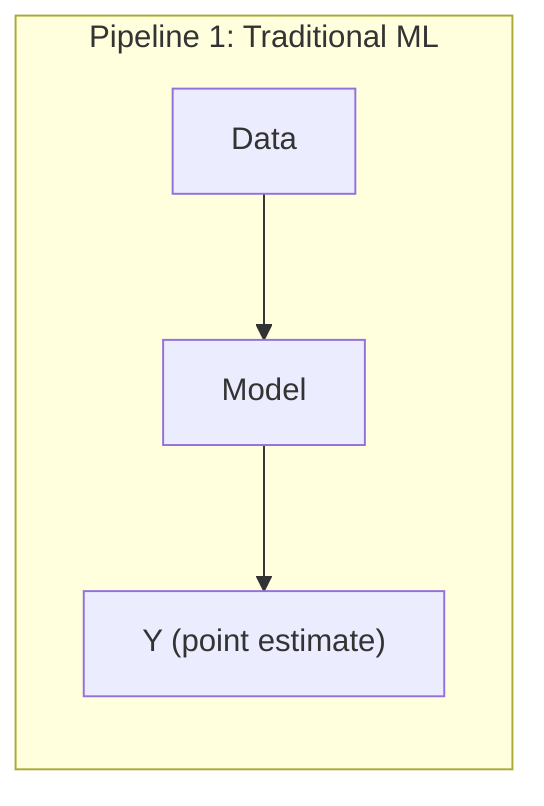
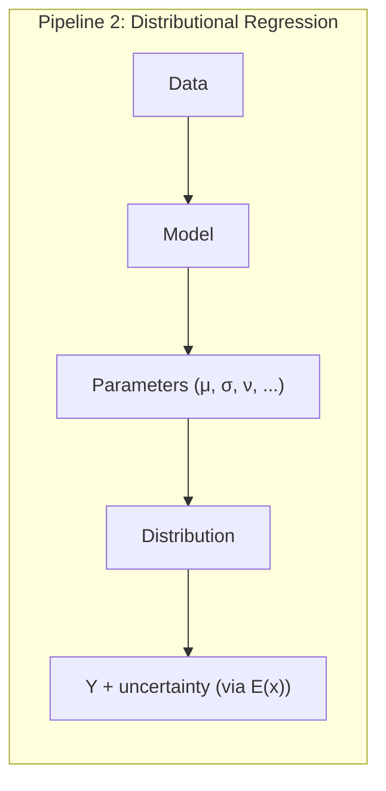
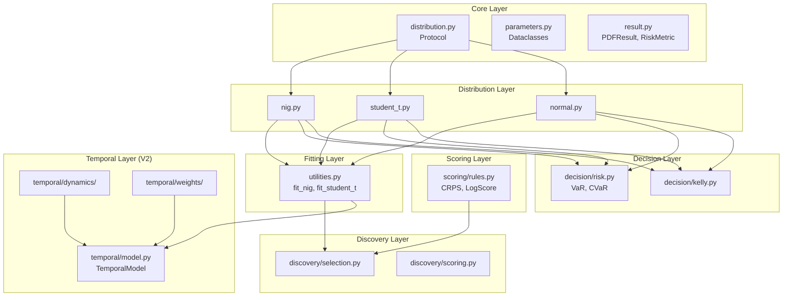
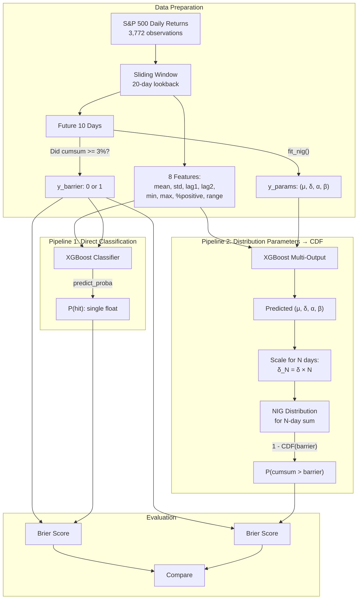
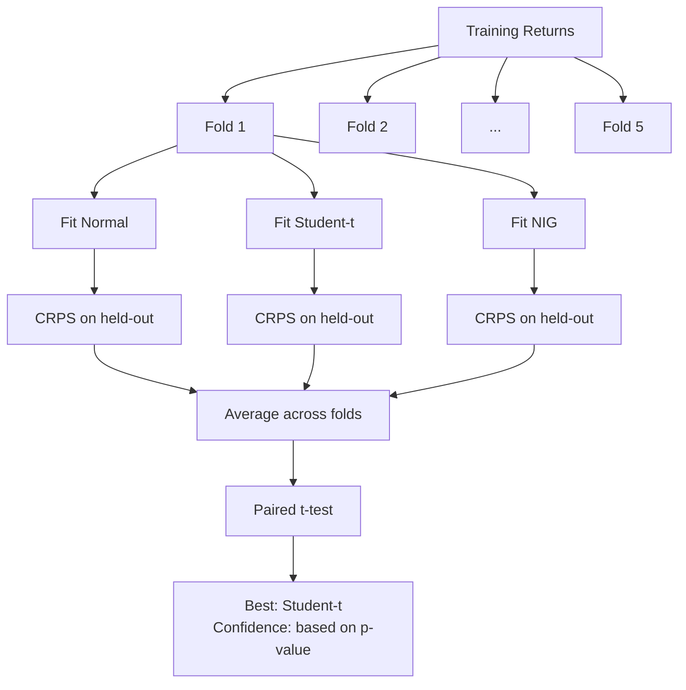
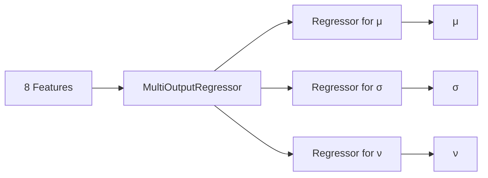
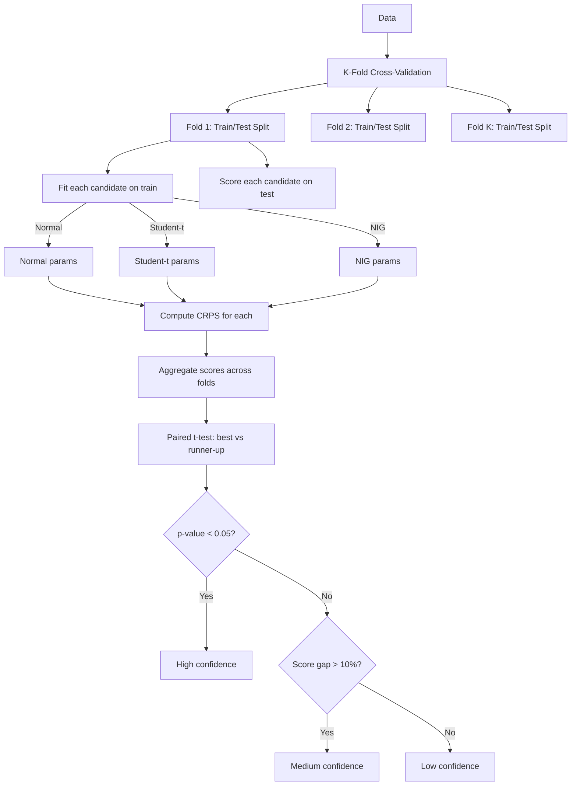

# temporalpdf: Complete Guide

A Python library for **distributional regression** and **probabilistic forecasting**. Instead of predicting single numbers, predict entire probability distributions.

---

## Table of Contents

1. [The Core Concept](#1-the-core-concept)
2. [Repository Architecture](#2-repository-architecture)
3. [v3_barrier_showcase.ipynb Walkthrough](#3-v3_barrier_showcaseipynb-walkthrough)
4. [Distributions](#4-distributions)
5. [Fitting](#5-fitting)
6. [Discovery (Automatic Selection)](#6-discovery-automatic-selection)
7. [Scoring Rules](#7-scoring-rules)
8. [Decision Utilities](#8-decision-utilities)
9. [Temporal Modeling (V2)](#9-temporal-modeling-v2)
10. [Backtesting](#10-backtesting)
11. [Complete Pipeline: Where Distribution Functions Are Used](#11-complete-pipeline-where-distribution-functions-are-used)
12. [Glossary](#12-glossary)

---

## 1. The Core Concept

### The Two Pipelines

The fundamental insight of this library:





| Aspect | Pipeline 1 | Pipeline 2 |
|--------|-----------|------------|
| Model output | Single value | Distribution parameters |
| Point prediction | Direct | Mean/median of distribution |
| Uncertainty | None (or post-hoc) | Built-in |
| Risk metrics | Cannot compute | VaR, CVaR, Kelly directly available |
| Flexibility | Must retrain for new questions | Re-simulate without retraining |

### Why This Matters

Consider predicting "+2% return":

| Metric | Scenario A | Scenario B |
|--------|------------|------------|
| Point prediction | +2% | +2% |
| True distribution | N(2%, 1%) | N(2%, 20%) |
| P(loss > 5%) | 0.0001% | 36.3% |
| Optimal Kelly fraction | 200% | 0.5% |

Same prediction. Radically different decisions. Pipeline 2 captures this difference.

### What Pipeline 2 Is NOT

Pipeline 2 is **not** fitting a distribution to residuals after making predictions. That would be:

```
Data → Model → Y_pred → Residuals → Distribution (wrong!)
```

Pipeline 2 trains the model to output distribution parameters **directly**:

```
Data → Model → (μ, σ, ν) → Distribution → Y + uncertainty (correct!)
```

---

## 2. Repository Architecture

### Directory Structure

```
temporalpdf/
├── src/temporalpdf/
│   ├── __init__.py              # Public API exports
│   ├── api.py                   # High-level facade (V2)
│   ├── utilities.py             # fit_nig, fit_student_t, etc.
│   │
│   ├── core/                    # Base abstractions
│   │   ├── distribution.py      # TimeEvolvingDistribution protocol
│   │   ├── parameters.py        # Parameter dataclasses
│   │   ├── result.py            # PDFResult, RiskMetric, DecisionSummary
│   │   ├── grid.py              # EvaluationGrid
│   │   └── volatility.py        # VolatilityModel (GARCH, mean-reverting)
│   │
│   ├── distributions/           # Distribution implementations
│   │   ├── nig.py               # Normal Inverse Gaussian
│   │   ├── normal.py            # Normal
│   │   ├── student_t.py         # Student-t
│   │   ├── skew_normal.py       # Skew-Normal
│   │   ├── generalized_laplace.py
│   │   └── registry.py          # Distribution factory
│   │
│   ├── discovery/               # Automatic distribution selection
│   │   ├── selection.py         # discover() function
│   │   ├── scoring.py           # CRPS from samples
│   │   └── significance.py      # Paired t-tests
│   │
│   ├── scoring/                 # Proper scoring rules
│   │   └── rules.py             # CRPS, LogScore, crps_normal
│   │
│   ├── decision/                # Risk measures & position sizing
│   │   ├── risk.py              # VaR, CVaR
│   │   ├── kelly.py             # Kelly criterion
│   │   └── probability.py       # prob_greater_than, etc.
│   │
│   ├── temporal/                # V2: Time-evolving models
│   │   ├── model.py             # TemporalModel class
│   │   ├── projection.py        # Forward parameter projection
│   │   ├── predictive.py        # PredictiveDistribution
│   │   ├── weights/             # Weighting schemes (SMA, EMA, etc.)
│   │   ├── dynamics/            # Parameter dynamics (AR, GARCH, etc.)
│   │   └── tracking/            # ParameterTracker
│   │
│   ├── backtest/                # Backtesting framework
│   │   ├── runner.py            # Backtest class
│   │   └── tests.py             # Kupiec, Christoffersen tests
│   │
│   ├── visualization/           # Plotting
│   │   ├── plotter.py           # PDFPlotter (matplotlib)
│   │   └── interactive.py       # InteractivePlotter (plotly)
│   │
│   └── validation/              # Model validation
│       ├── validator.py
│       └── metrics.py
│
├── tests/                       # Test suite
├── examples/                    # Usage examples
├── showcase/                    # Demo scripts
└── data/                        # Sample data
```

### Module Dependency Graph



---

## 3. v3_barrier_showcase.ipynb Walkthrough

This notebook demonstrates the two pipelines on a **barrier problem**: predicting whether cumulative returns will hit +3% at any point in the next 10 days.

### The Problem

```
Question: P(S&P 500 cumulative return hits +3% within 10 days)
```

This is **path-dependent** (like American options). You must check every day, not just the final day.

### Complete Pipeline Diagram



### Why CDF, Not Monte Carlo

The NIG distribution is **closed under convolution**. If daily returns follow NIG(μ, δ, α, β), then the sum of N days follows:

```
NIG(N×μ, N×δ, α, β)
```

This means we can compute P(N-day cumulative > barrier) **exactly**:

```python
# Scale parameters for N-day sum
params_N = NIGParameters(
    mu=params.mu * N,
    delta=params.delta * N,
    alpha=params.alpha,
    beta=params.beta
)

# Use CDF directly - no simulation needed
p_exceed = 1 - nig.cdf(barrier, t=0, params=params_N)
```

**Note on barrier problems**: The original notebook asks "P(hits barrier at ANY point)", which is path-dependent and harder. For that specific problem, you'd need either:
1. Reflection principle approximation (for Brownian motion)
2. Numerical PDE methods
3. Simulation (as a fallback)

But for most practical cases, P(N-day cumulative > X) is what you actually want, and that's exact via CDF.

### Step-by-Step Explanation

#### Step 1: Load Data (Cell 3)

```python
df = pd.read_csv('data/equity_returns.csv')
returns = df['return_pct'].values  # 3,772 daily returns
BARRIER = 3.0   # +3% barrier
HORIZON = 10    # 10 days
```

#### Step 2: Feature Engineering (Cell 4)

For each day, extract 8 features from the previous 20 days:

| Feature | Description | Why Include It |
|---------|-------------|----------------|
| `mean(window)` | Average return | Recent momentum |
| `std(window)` | Volatility | Higher vol → higher barrier prob |
| `window[-1]` | Yesterday's return | Immediate momentum |
| `window[-2]` | Day before | Short-term pattern |
| `min(window)` | Worst day | Downside exposure |
| `max(window)` | Best day | Upside potential |
| `sum(>0)/n` | % positive days | Sentiment proxy |
| `max - min` | Range | Recent turbulence |

**Two targets are created:**

```python
# Target for Pipeline 1: Did barrier get hit?
max_cumsum = np.max(np.cumsum(future_returns))
y_barrier = (max_cumsum >= 3.0)  # Boolean

# Target for Pipeline 2: Distribution parameters
params = tpdf.fit_student_t(future_returns)
y_params = [params.mu_0, params.sigma_0, params.nu]  # 3 floats
```

#### Step 3: Pipeline 1 - Train Classifier (Cell 6)

```python
clf_p1 = GradientBoostingClassifier(n_estimators=100, max_depth=3)
clf_p1.fit(X_train, y_train)  # y_train is binary
p_barrier_p1 = clf_p1.predict_proba(X_test)[:, 1]  # P(hit)
```

**What happens:**
- Input: 8 features
- Output: 1 probability
- Model learns: features → P(barrier hit) directly

#### Step 4: Pipeline 2 - Discover Best Distribution (Cell 8)

```python
discovery = tpdf.discover(
    returns[train_slice],
    candidates=['normal', 'student_t', 'nig'],
    cv_folds=5,
)
# Result: best='student_t', confidence='low'
```

**What `discover()` does:**



#### Step 5: Pipeline 2 - Train Multi-Output Model (Cell 10)

```python
model_p2 = MultiOutputRegressor(
    GradientBoostingRegressor(n_estimators=100, max_depth=3)
)
model_p2.fit(X_train, y_params_train)  # y_params has 3 columns
y_params_pred = model_p2.predict(X_test)  # Predicts (μ, σ, ν) for each sample
```

**What happens:**
- Input: Same 8 features as Pipeline 1
- Output: 3 values (μ, σ, ν)
- Internally: 3 separate regressors, one per parameter



#### Step 6: Pipeline 2 - Compute Probability via CDF

```python
for i in range(len(y_test)):
    # Get predicted parameters
    pred_params = y_params_pred[i]

    # Create distribution from predicted params
    params = tpdf.NIGParameters(
        mu=pred_params[0],
        delta=max(pred_params[1], 0.01),
        alpha=max(pred_params[2], 0.1),
        beta=pred_params[3]
    )

    # Scale parameters for N-day cumulative return
    # NIG is closed under convolution: sum of N iid NIG is NIG with scaled params
    params_N = tpdf.NIGParameters(
        mu=params.mu * HORIZON,        # Location scales linearly
        delta=params.delta * HORIZON,  # Scale scales linearly
        alpha=params.alpha,            # Shape unchanged
        beta=params.beta               # Skewness unchanged
    )

    # Compute probability directly via CDF - no simulation needed
    p_hit = 1.0 - nig.cdf(np.array([BARRIER]), t=0, params=params_N)[0]
```

**Why this works:**

The NIG distribution's closure under convolution is a key property:

```
If X₁, X₂, ..., Xₙ ~ iid NIG(μ, δ, α, β)

Then X₁ + X₂ + ... + Xₙ ~ NIG(n×μ, n×δ, α, β)
```

So P(10-day cumulative return > 3%) is simply:

```
P(∑Xᵢ > 0.03) = 1 - F_NIG(0.03; 10μ, 10δ, α, β)
```

This is exact, fast, and requires no random sampling.

#### Step 7: Evaluation (Cells 15-16)

**Brier Score**: Measures probability prediction accuracy

```
Brier = mean((P_predicted - Y_actual)²)
```

Where Y_actual is 0 or 1. Range 0-1, lower is better.

**Results:**
| Metric | Pipeline 1 | Pipeline 2 |
|--------|-----------|------------|
| Brier Score | 0.1966 | 0.1923 |
| Mean Prediction | 0.276 | 0.246 |
| Actual Rate | 0.287 | 0.287 |
| Has Uncertainty CI | No | Yes |

Pipeline 2 wins slightly on Brier score AND provides uncertainty estimates.

#### Step 8: Regime Analysis (Cells 18-19)

Split test data by volatility regime:

| Regime | Actual Hit Rate | P1 Error | P2 Error | Winner |
|--------|-----------------|----------|----------|--------|
| High Vol | 39.6% | 3.9% | 4.3% | P1 |
| Low Vol | 17.9% | 6.1% | 3.9% | P2 |

**Key insight**: Pipeline 2 adapts better in low volatility because it directly models the distribution shape.

### Pipeline 2 Advantages

1. **Exact computation**: Use CDF directly, no Monte Carlo approximation
2. **Flexibility**: Change the question (5% barrier? 20 days?) without retraining - just recompute CDF
3. **Composability**: VaR = ppf(α), CVaR = integral, probabilities = CDF evaluation
4. **Multi-horizon**: Scale parameters for any horizon N via convolution property
5. **Interpretability**: Parameters have meaning (μ = location, δ = scale, α = tail weight, β = skew)

---

## 4. Distributions

### Available Distributions

| Distribution | Parameters | Use Case |
|--------------|------------|----------|
| **NIG** | μ, δ, α, β | Financial returns (gold standard) |
| **Student-t** | μ, σ, ν | Heavy tails, outlier robustness |
| **Normal** | μ, σ | Baseline, fast computation |
| **Skew-Normal** | μ, σ, α | Light tails with asymmetry |
| **Generalized Laplace** | μ, σ, k, λ | Flexible custom |

### Normal Inverse Gaussian (NIG)

The NIG distribution is preferred for financial returns because:

1. **Captures stylized facts**: Semi-heavy tails, skewness, excess kurtosis
2. **Closed under convolution**: Daily → weekly returns analytically tractable
3. **Interpretable parameters**:

| Parameter | Symbol | Meaning | Typical Range |
|-----------|--------|---------|---------------|
| Location | μ | Center of distribution | -0.01 to 0.01 |
| Scale | δ | Spread (volatility-like) | 0.005 to 0.05 |
| Tail heaviness | α | Higher = lighter tails | 5 to 50 |
| Skewness | β | Negative = left-skewed | -5 to 5 |

**Mathematical formulation:**

```
f(x; α, β, μ, δ) = (αδ/π) × exp(δγ + β(x-μ)) × K₁(α×q(x)) / q(x)

where:
  γ = √(α² - β²)
  q(x) = √(δ² + (x - μ)²)
  K₁ = modified Bessel function of the second kind
```

**Constraints**: α > 0, δ > 0, |β| < α

### Student-t Distribution

| Parameter | Symbol | Meaning |
|-----------|--------|---------|
| Location | μ₀ | Center |
| Scale | σ₀ | Spread |
| Degrees of freedom | ν | Tail heaviness (lower = fatter) |

When ν → ∞, Student-t → Normal. When ν ≈ 3-5, you get heavy tails.

### Distribution Protocol

All distributions implement this interface:

```python
class Distribution(Protocol):
    def pdf(self, x, t, params) -> array:
        """Probability density function"""

    def cdf(self, x, t, params) -> array:
        """Cumulative distribution function"""

    def ppf(self, q, t, params) -> array:
        """Percent point function (inverse CDF / quantile)"""

    def sample(self, n, t, params, rng=None) -> array:
        """Generate random samples"""

    def mean(self, t, params) -> float:
        """Expected value"""

    def variance(self, t, params) -> float:
        """Variance"""
```

The `t` parameter enables time-evolving distributions (parameters that change over forecast horizon).

---

## 5. Fitting

### Maximum Likelihood Estimation (MLE)

Fitting finds parameters that maximize the likelihood of observing the data:

```python
# Fit NIG to returns
params = tpdf.fit_nig(returns)
# Returns: NIGParameters(mu=0.0003, delta=0.012, alpha=18.5, beta=-1.2)

# Fit Student-t
params = tpdf.fit_student_t(returns)
# Returns: StudentTParameters(mu_0=0.0002, sigma_0=0.011, nu=4.2)

# Fit Normal
params = tpdf.fit_normal(returns)
# Returns: NormalParameters(mu_0=0.0003, sigma_0=0.012)

# Generic interface
params = tpdf.fit(returns, distribution='nig')
```

### How MLE Works

For NIG fitting (`utilities.py:27-67`):

```python
def fit_nig(data):
    # Initial guess based on moments
    x0 = [np.mean(data), np.log(np.std(data)), np.log(5.0), 0.0]

    def negative_log_likelihood(theta):
        mu, delta, alpha, beta = transform(theta)
        params = NIGParameters(mu, delta, alpha, beta)
        pdf_vals = nig.pdf(data, 0, params)
        return -np.sum(np.log(pdf_vals))

    # Minimize negative log-likelihood
    result = optimize.minimize(nll, x0, method="Nelder-Mead")
    return NIGParameters(...)
```

---

## 6. Discovery (Automatic Selection)

### The `discover()` Function

Automatically selects the best distribution using cross-validation:

```python
result = tpdf.discover(
    data=returns,
    candidates=['normal', 'student_t', 'nig'],
    scoring=['crps'],
    cv_folds=5,
    significance_level=0.05,
)

print(result.best)        # 'nig'
print(result.confidence)  # 'high', 'medium', or 'low'
print(result.scores)      # {'normal': 0.0082, 'student_t': 0.0075, 'nig': 0.0071}
```

### Discovery Process



### Confidence Levels

| Confidence | Meaning | Criteria |
|------------|---------|----------|
| High | Strong statistical evidence | p-value < 0.05 in paired t-test |
| Medium | Moderate evidence | Score gap > 3% but not significant |
| Low | Weak evidence | Scores are similar |

---

## 7. Scoring Rules

### What Are Proper Scoring Rules?

A **proper scoring rule** rewards honest probability forecasts. If you believe P=0.7, reporting P=0.7 should give the best expected score.

### CRPS (Continuous Ranked Probability Score)

```
CRPS(F, y) = E|X - y| - 0.5 × E|X - X'|
```

Where X, X' are independent samples from forecast distribution F.

**Properties:**
- Generalizes MAE to probabilistic forecasts
- Always finite (unlike log score)
- Same units as the observation
- Lower is better

```python
# Monte Carlo CRPS
score = tpdf.crps(dist, params, y=actual_return)

# Closed-form for Normal (faster)
score = tpdf.crps_normal(y=actual, mu=0.01, sigma=0.02)
```

### Log Score (Negative Log-Likelihood)

```
LogScore(F, y) = -log(f(y))
```

Where f(y) is the PDF at the observation.

**Properties:**
- Local: only depends on density at observation
- Can be -∞ if density is zero
- Sensitive to tail calibration
- Lower is better

```python
score = tpdf.log_score(dist, params, y=actual_return)
```

### When to Use Which

| Scoring Rule | Use When |
|--------------|----------|
| CRPS | General purpose, robust |
| Log Score | Tail accuracy matters, density is never zero |

---

## 8. Decision Utilities

### Value at Risk (VaR)

**Definition**: The α-quantile of the loss distribution.

"There is an α% chance of losing more than VaR."

```python
var_95 = tpdf.var(dist, params, alpha=0.05)  # 95% VaR
# Example: var_95 = 0.032 means "5% chance of losing > 3.2%"
```

**Mathematical formula:**
```
VaR_α = -F⁻¹(α)
```

Where F⁻¹ is the inverse CDF (quantile function).

**Properties:**
- NOT coherent (fails subadditivity)
- Easy to interpret
- Does NOT capture tail severity

### Conditional VaR (CVaR / Expected Shortfall)

**Definition**: Expected loss given that loss exceeds VaR.

"If we're in the worst α% of outcomes, what's the expected loss?"

```python
cvar_95 = tpdf.cvar(dist, params, alpha=0.05)  # 95% CVaR
# Example: cvar_95 = 0.048 means "Expected loss in worst 5% is 4.8%"
```

**Mathematical formula:**
```
CVaR_α = E[X | X ≤ VaR_α] = (1/α) × ∫_{-∞}^{VaR_α} x × f(x) dx
```

For distributions with closed-form PDF, this integral can be computed numerically. For Normal, there's a closed form:
```
CVaR_α = μ - σ × φ(Φ⁻¹(α)) / α
```

**Properties:**
- Coherent risk measure (satisfies subadditivity)
- Captures tail severity
- Always ≥ VaR
- Convex → enables portfolio optimization

### Kelly Criterion

**Definition**: Optimal fraction of wealth to bet to maximize long-run geometric growth.

```python
kelly = tpdf.kelly_fraction(dist, params)
half_kelly = tpdf.fractional_kelly(dist, params, fraction=0.5)
```

**Approximation for small returns:**
```
f* ≈ μ / σ²
```

**Fractional Kelly tradeoffs:**

| Fraction κ | Growth vs Full | Variance vs Full |
|------------|---------------|------------------|
| 1.0 (full) | 100% | 100% |
| 0.5 (half) | 75% | 25% |
| 0.25 (quarter) | 44% | 6% |

Half-Kelly is common in practice: 75% of the growth, 25% of the variance.

### Probability Queries

```python
# P(return > 0)
p_profit = tpdf.prob_greater_than(dist, params, threshold=0)

# P(loss > 5%)
p_big_loss = tpdf.prob_less_than(dist, params, threshold=-0.05)

# P(return between -2% and +2%)
p_range = tpdf.prob_between(dist, params, lower=-0.02, upper=0.02)
```

### Distribution Functions → Risk Metrics

Every risk metric maps directly to a distribution function:

| Metric | Formula | Distribution Function |
|--------|---------|----------------------|
| VaR | -F⁻¹(α) | `ppf(α)` (quantile) |
| CVaR | ∫ x·f(x) dx / α | `pdf` + numerical integration |
| P(X > k) | 1 - F(k) | `1 - cdf(k)` |
| P(X < k) | F(k) | `cdf(k)` |
| E[X] | ∫ x·f(x) dx | `mean()` or closed-form |
| Kelly | μ/σ² | `mean() / variance()` |

No Monte Carlo required for any of these.

### V2 API: Metrics with Confidence Intervals

For confidence intervals on parameter estimates, bootstrap the fitting process:

```python
# VaR with bootstrap CI (bootstraps the parameter estimation)
var_result = tpdf.var_with_ci(dist, params, alpha=0.05, confidence_level=0.90)
print(var_result.value)               # 0.032
print(var_result.confidence_interval) # (0.028, 0.037)
print(var_result.standard_error)      # 0.003

# CVaR with CI
cvar_result = tpdf.cvar_with_ci(dist, params, alpha=0.05)

# Kelly with CI
kelly_result = tpdf.kelly_with_ci(dist, params)
```

---

## 9. Temporal Modeling (V2)

### The Problem

Distribution parameters aren't constant. Volatility clusters. Mean reverts. How do we model this?

### TemporalModel Class

```python
from temporalpdf import TemporalModel, ParameterTracker, EMA, MeanReverting, GARCH

model = TemporalModel(
    distribution="nig",
    tracking=ParameterTracker("nig", window=60),
    weighting=EMA(halflife=20),
    dynamics={
        "mu": Constant(),
        "delta": GARCH(1, 1),
        "alpha": MeanReverting(),
        "beta": Constant(),
    },
)

model.fit(returns)
projection = model.project(horizon=30)
decision = model.decision(t=5, alpha=0.05)
```

### Weighting Schemes

Control how observations are weighted when fitting:

| Scheme | Formula | Use Case |
|--------|---------|----------|
| SMA | 1/n for all | Equal weight |
| EMA | λ^t | Recent data matters more |
| Linear | (n-t)/n | Linear decay |
| PowerDecay | t^(-p) | Smooth decay |
| Gaussian | exp(-t²/2σ²) | Concentrated around recent |

```python
from temporalpdf import SMA, EMA, Linear, PowerDecay, Gaussian

weights = EMA(halflife=20)      # Half-life of 20 periods
weights = PowerDecay(power=0.5) # w[t] ∝ t^(-0.5)
```

### Dynamics Models

Control how parameters evolve over time:

#### Constant
```python
from temporalpdf import Constant
# Parameter stays at current value
```

#### RandomWalk
```python
from temporalpdf import RandomWalk
# θ[t+1] = θ[t] + drift + σ × ε
```

#### MeanReverting (Ornstein-Uhlenbeck)
```python
from temporalpdf import MeanReverting
# θ[t+1] = θ[t] + κ × (θ_long - θ[t]) + σ × ε
# κ = mean reversion speed
# Half-life = ln(2) / κ
```

#### AR (Autoregressive)
```python
from temporalpdf import AR
# θ[t] = c + φ₁×θ[t-1] + ... + φₚ×θ[t-p] + σ × ε
```

#### GARCH
```python
from temporalpdf import GARCH
# σ²[t] = ω + α×ε²[t-1] + β×σ²[t-1]
# For volatility parameters
```

### Projection

```python
projection = model.project(horizon=30, n_paths=1000)

# projection.param_paths['mu'] has shape (1000, 30)
# Each row is one simulated path of mu over 30 periods
```

### Predictive Distribution

```python
predictive = model.predictive(t=5, n_samples=10000)

# Integrates over parameter uncertainty
var_at_t5 = predictive.var(alpha=0.05)
decision = predictive.decision_summary()
```

---

## 10. Backtesting

### Rolling VaR Backtest

```python
result = tpdf.rolling_var_backtest(
    data=returns,
    distribution='nig',
    lookback=252,
    alpha=0.05,
)

print(result['exceedance_rate'])  # Should be ~5%
print(result['kupiec_pvalue'])    # p-value from Kupiec test
print(result['status'])           # 'PASS' or 'FAIL'
```

### Kupiec Test

Tests whether observed exceedance rate matches expected rate.

**Null hypothesis**: True exceedance rate = α

```
LR = -2 × [n×log(1-α) - (k×log(p̂) + (n-k)×log(1-p̂))]
```

Where:
- n = number of observations
- k = number of exceedances
- p̂ = k/n (observed rate)

LR ~ χ²(1) under null.

### Christoffersen Test

Tests for independence of exceedances (no clustering).

**Null hypothesis**: Exceedances are independent

If VaR violations cluster, the model fails to capture volatility dynamics.

---

## 11. Complete Pipeline: Where Distribution Functions Are Used

This section maps exactly where PDF, CDF, PPF, and sampling are used across the entire library.

### Stage 1: Distribution Selection (`discover()`)

**Goal**: Choose which distribution family (Normal, Student-t, Normal Inverse Gaussian) best fits the data.

| Step | What happens | Uses |
|------|--------------|------|
| Fit each candidate | Maximum Likelihood Estimation to find parameters | **PDF** |
| Score on held-out data | Continuous Ranked Probability Score or Log Score | **CDF** or **PDF** |
| Compare scores | Paired t-test across cross-validation folds | Statistics only |

**How it works:**
1. Split data into K folds (e.g., 5)
2. For each fold: fit each candidate distribution on training portion, score on test portion
3. **Fitting**: Find parameters θ that maximize Σ log(pdf(xᵢ; θ)) — the parameters that make observed data most probable
4. **Scoring with Continuous Ranked Probability Score**: Measures how well the predicted cumulative distribution function matches reality. Computed as ∫F(x)² dx + ∫(1-F(x))² dx around each observation. Lower = better fit.
5. **Scoring with Log Score**: Simply -log(pdf(y)) — how much probability density the distribution assigned to what actually happened
6. Average scores across folds, pick distribution with lowest average score
7. Confidence determined by whether score differences are statistically significant

### Stage 2: Parameter Fitting (`fit_nig()`, `fit_student_t()`, etc.)

**Goal**: Estimate distribution parameters (μ, δ, α, β for Normal Inverse Gaussian) from observed data.

| Step | What happens | Uses |
|------|--------------|------|
| Maximum Likelihood Estimation optimization | Find θ that maximizes Σ log(pdf(xᵢ; θ)) | **PDF** |

**How it works:**
1. Start with initial parameter guess (often from sample moments: mean, variance, skewness, kurtosis)
2. Define objective: negative log-likelihood = -Σ log(pdf(xᵢ; θ))
3. Use numerical optimizer (Nelder-Mead, L-BFGS-B) to minimize this
4. Optimizer tries different θ values, evaluates PDF at each data point, sums log-probabilities
5. Converges to parameters that make the observed data most probable under the distribution
6. Return fitted parameter object (e.g., `NIGParameters(mu=0.001, delta=0.02, alpha=15, beta=-0.5)`)

**Why Maximum Likelihood Estimation**: It's consistent (converges to true parameters with enough data), efficient (achieves lowest possible variance), and has known statistical properties for confidence intervals.

### Stage 3: Risk Metrics (`var()`, `cvar()`, `kelly()`)

**Goal**: Compute actionable risk measures from the fitted distribution.

| Metric | Formula | Uses |
|--------|---------|------|
| Value at Risk | -F⁻¹(α) | **PPF** (percent point function / quantile) |
| Conditional Value at Risk | ∫ x·f(x) dx / ∫ f(x) dx over tail | **PDF** + numerical integration |
| Kelly fraction | μ/σ² | **mean/variance** (closed form or integration) |
| P(X > k) | 1 - F(k) | **CDF** |

**How Value at Risk works:**
1. Value at Risk answers: "What's the loss threshold such that we only exceed it α% of the time?"
2. This is the α-quantile of the return distribution, negated (since losses are negative returns)
3. Computed by evaluating the inverse cumulative distribution function: `ppf(α)`
4. Example: 95% Value at Risk with α=0.05 gives the 5th percentile, negated
5. If ppf(0.05) = -0.032, then Value at Risk = 0.032, meaning "5% chance of losing more than 3.2%"

**How Conditional Value at Risk works:**
1. Conditional Value at Risk answers: "If we're in the worst α% of outcomes, what's the expected loss?"
2. It's the conditional expectation E[X | X ≤ Value at Risk quantile]
3. Computed by integrating x × pdf(x) over the left tail, divided by the tail probability
4. Numerically: ∫_{-∞}^{quantile} x·f(x) dx / ∫_{-∞}^{quantile} f(x) dx
5. Always ≥ Value at Risk because it captures the severity of tail losses, not just the threshold

**How Kelly works:**
1. Kelly criterion answers: "What fraction of wealth should I bet to maximize long-run growth?"
2. For small returns: optimal fraction ≈ μ/σ² (expected return divided by variance)
3. Uses the distribution's mean and variance, which can be computed from parameters or by integrating x·pdf(x) and (x-μ)²·pdf(x)

### Stage 4: Confidence Intervals on Risk Metrics

**Goal**: Quantify how uncertain our Value at Risk/Conditional Value at Risk estimates are due to finite data.

**Source of uncertainty**: We estimated parameters from N data points. Different data would give different parameters → different risk metrics.

| Step | What happens | Uses |
|------|--------------|------|
| Bootstrap resample original data | Draw N samples with replacement from original observations | None |
| Re-fit parameters | Maximum Likelihood Estimation on bootstrap sample | **PDF** |
| Compute metric | Value at Risk or Conditional Value at Risk with new parameters | **PPF/PDF** |
| Repeat B times (e.g., 1000) | Get distribution of metric estimates | — |
| Extract confidence interval | 5th and 95th percentile of bootstrap metrics | — |

**How it should work:**
1. Original data: [x₁, x₂, ..., xₙ] → fit → params → Value at Risk = 0.032
2. Bootstrap sample 1: [x₃, x₃, x₇, x₁, ...] (same size, with replacement) → fit → params₁ → Value at Risk₁ = 0.029
3. Bootstrap sample 2: [x₅, x₂, x₂, x₉, ...] → fit → params₂ → Value at Risk₂ = 0.035
4. ... repeat 1000 times ...
5. Sort all Value at Risk values, take 5th and 95th percentile → 90% confidence interval

**Why bootstrap**: It approximates the sampling distribution of the estimator without assuming a parametric form. The spread of bootstrap estimates reflects how much our estimate would vary with different data samples.

### Stage 5: Multi-Period Scaling

**Goal**: Predict the distribution of N-day cumulative returns from daily parameters.

| Step | What happens | Uses |
|------|--------------|------|
| Scale parameters | Normal Inverse Gaussian: μ_N = N·μ, δ_N = N·δ, α unchanged, β unchanged | Convolution property |
| Compute P(sum > barrier) | 1 - F_N(barrier) | **CDF** of scaled distribution |

**How it works:**
1. Daily returns follow Normal Inverse Gaussian(μ, δ, α, β)
2. Sum of N independent Normal Inverse Gaussian random variables is also Normal Inverse Gaussian (closure under convolution)
3. The N-day sum follows Normal Inverse Gaussian(N·μ, N·δ, α, β)
4. To find P(10-day cumulative > 3%): evaluate 1 - CDF(0.03) using the scaled parameters
5. No simulation needed — it's a single cumulative distribution function evaluation

**Why this matters**: You can answer questions about any horizon without retraining. "What's P(5-day loss > 2%)?" Just scale parameters and evaluate cumulative distribution function.

**Limitation**: This assumes returns are independent and identically distributed. Real returns have autocorrelation and volatility clustering, which this ignores.

### Stage 6: Scoring Predictions (`crps()`, `log_score()`)

**Goal**: Evaluate how well a predicted distribution matched what actually happened (for model validation/comparison).

| Score | Formula | Uses |
|-------|---------|------|
| Continuous Ranked Probability Score | ∫ F(x)² dx + ∫ (1-F(x))² dx | **CDF** |
| Log Score | -log(f(y)) | **PDF** |

**How Continuous Ranked Probability Score works:**
1. You predicted distribution F, actual outcome was y
2. Continuous Ranked Probability Score measures the "distance" between your cumulative distribution function and the step function at y
3. Formula: ∫_{-∞}^{y} F(x)² dx + ∫_{y}^{∞} (1-F(x))² dx
4. If your distribution was concentrated near y, both integrals are small → low score
5. If your distribution was far from y, the integrals accumulate error → high score
6. Generalizes Mean Absolute Error to probabilistic forecasts
7. Same units as the data (e.g., percent return)

**How Log Score works:**
1. You predicted distribution f, actual outcome was y
2. Log Score = -log(f(y)) — how much probability density you assigned to what happened
3. If you assigned high density to y → small negative log → good score
4. If you assigned low density to y → large negative log → bad score
5. Penalizes overconfident wrong predictions heavily (if f(y) ≈ 0, score → ∞)

**Why these are "proper"**: A proper scoring rule is one where reporting your true belief gives the best expected score. You can't game it by lying about your distribution.

### Stage 7: Backtesting

**Goal**: Validate that the Value at Risk model works on historical data.

| Step | What happens | Uses |
|------|--------------|------|
| Rolling Value at Risk | At each time t, fit distribution on past data, compute Value at Risk | **PPF** |
| Count exceedances | How often did actual loss > predicted Value at Risk | Comparison |
| Kupiec test | Is exceedance rate statistically ≈ α? | Chi-squared test |
| Christoffersen test | Are exceedances independent (not clustered)? | Markov chain test |

**How it works:**
1. At time t=100: fit distribution on returns [1..99], compute 95% Value at Risk
2. At time t=101: check if return₁₀₀ < -Value at Risk (exceedance?)
3. Repeat for all t in test period
4. Count exceedances. For 95% Value at Risk over 1000 days, expect ~50 exceedances
5. **Kupiec test**: Tests if observed exceedance rate ≈ 5%. Uses likelihood ratio statistic.
6. **Christoffersen test**: Tests if exceedances are independent. If violations cluster (multiple bad days in a row), the model fails to capture volatility dynamics.

### Summary: What Each Function Needs

| Function | PDF | CDF | PPF | Sample |
|----------|-----|-----|-----|--------|
| `fit_*()` | ✓ | | | |
| `discover()` | ✓ | ✓ | | |
| `var()` | | | ✓ | |
| `cvar()` | ✓ | | ✓ | |
| `crps()` | | ✓ | ✓ | |
| `log_score()` | ✓ | | | |
| `kelly()` | | | | |
| `prob_*()` | | ✓ | | |
| `*_with_ci()` | ✓ | | ✓ | needs original data |

**Sampling is only needed for:**
- Validation (comparing numerical methods to Monte Carlo)
- Path-dependent problems (barrier hit at ANY point requires simulating paths)
- When numerical integration is prohibitively slow

---

## 12. Glossary

| Term | Definition |
|------|------------|
| **Barrier problem** | Predict if price touches a level at any point (path-dependent) |
| **Brier Score** | (predicted_prob - actual)² averaged; measures probability accuracy |
| **Calibration** | Whether P=30% predictions actually occur 30% of the time |
| **CRPS** | Continuous Ranked Probability Score; generalizes MAE to distributions |
| **CVaR / ES** | Conditional Value at Risk / Expected Shortfall; expected loss in tail |
| **Distributional regression** | Predicting distribution parameters, not point estimates |
| **GARCH** | Generalized Autoregressive Conditional Heteroskedasticity; volatility model |
| **Kelly criterion** | Optimal bet sizing to maximize log growth: f* ≈ μ/σ² |
| **MLE** | Maximum Likelihood Estimation; finding params that maximize P(data|params) |
| **Multi-output regression** | One model predicting multiple targets simultaneously |
| **NIG** | Normal Inverse Gaussian; 4-parameter distribution for financial returns |
| **Ornstein-Uhlenbeck** | Mean-reverting stochastic process |
| **PPF** | Percent Point Function; inverse CDF (quantile function) |
| **Proper scoring rule** | Score that rewards honest probability reporting |
| **Student-t** | Distribution with heavier tails than Normal; ν controls tail weight |
| **VaR** | Value at Risk; α-quantile of loss distribution |

---

## Quick Reference

### Basic Usage

```python
import temporalpdf as tpdf

# Fit distribution
params = tpdf.fit_nig(returns)

# Risk measures
var_95 = tpdf.var(tpdf.NIG(), params, alpha=0.05)
cvar_95 = tpdf.cvar(tpdf.NIG(), params, alpha=0.05)
kelly = tpdf.kelly_fraction(tpdf.NIG(), params)

# Probability queries
p_profit = tpdf.prob_greater_than(tpdf.NIG(), params, 0)

# Evaluate forecast
crps_score = tpdf.crps(tpdf.NIG(), params, y=actual_return)

# Automatic selection
result = tpdf.discover(returns)
print(f"Best: {result.best}, Confidence: {result.confidence}")
```

### V2 API

```python
import temporalpdf as tpdf

# Temporal model
model = tpdf.TemporalModel(
    distribution="nig",
    weighting=tpdf.EMA(halflife=20),
    dynamics={"delta": tpdf.GARCH(1, 1)},
)
model.fit(returns)

# Project and decide
decision = model.decision(t=5, alpha=0.05)
print(decision.var)
print(decision.cvar)
print(decision.kelly)
```
