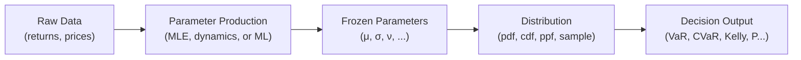
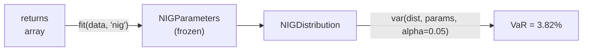
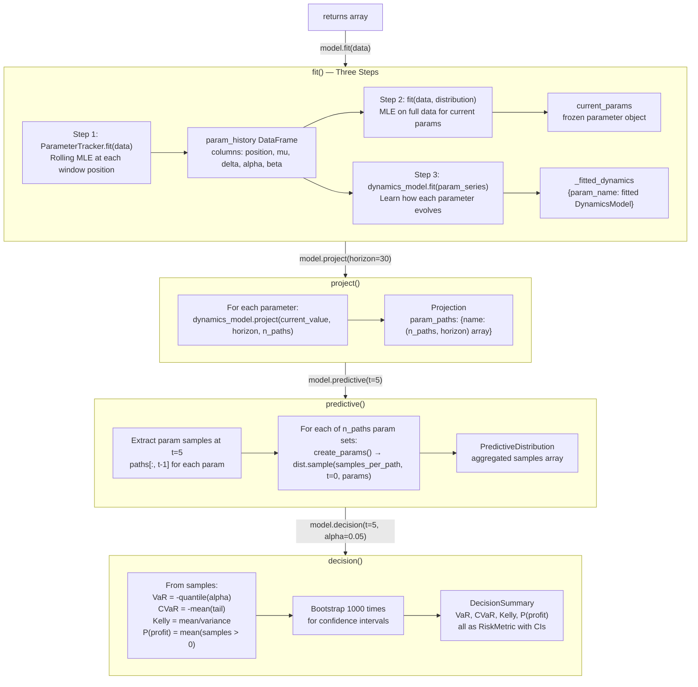
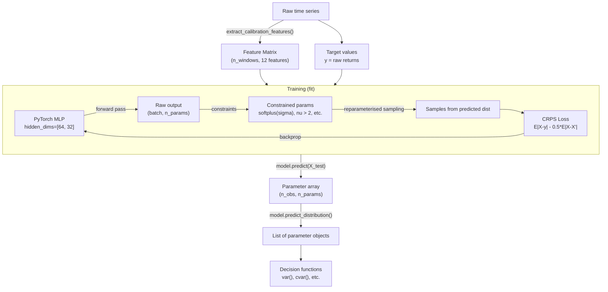
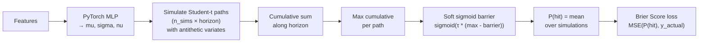
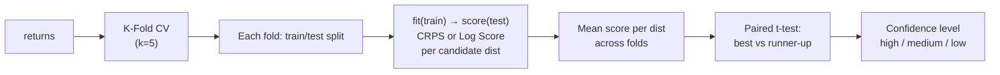
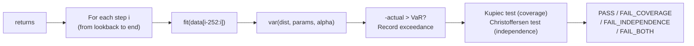
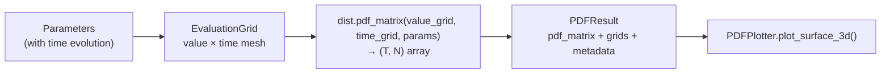
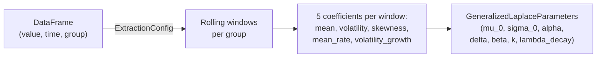

# temporalpdf Pipelines

How data flows through the library. Every pipeline, every fork, where parameters are created versus consumed, and where decisions get made.

---

## Context: The Conventional Approach and What This Library Does Differently

Most quantitative workflows follow a single pipeline:

```
Data → Model → Point Prediction (Y)
```

The model predicts a number. There is no distribution, no uncertainty quantification, no risk decomposition. If you want confidence intervals, you bolt them on after the fact (e.g., by fitting a distribution to residuals).

temporalpdf takes a different approach. Instead of predicting Y directly, the model predicts **distribution parameters** — and the distribution itself produces Y along with everything else:

```
Data → Model → Distribution Parameters (μ, σ, ν, ...) → Distribution → Y + uncertainty + risk metrics
```

Both approaches produce point predictions. Both have residuals. But the distributional approach gets its point prediction *from* the distribution, and gets uncertainty, quantiles, VaR, CVaR, Kelly sizing, and tail probabilities as a direct consequence of the modelling step — not as a post-hoc decoration.

This library provides four pipelines for producing distribution parameters, plus supporting pipelines for selection, validation, and backtesting. They range from the conventional (fit a distribution to data) to the novel (train a neural network to output distribution parameters via proper scoring rules).

---

## Pipeline Map

| Pipeline | How Parameters Are Produced | Uncertainty Source | Primary Use Case |
|---|---|---|---|
| **1. Quick Fit** | MLE on a single data window | None (point estimate only) | Immediate risk metrics, baseline comparison |
| **2. Temporal Model** | Rolling MLE + dynamics projection | Monte Carlo over projected parameter paths | Forward-looking risk with parameter uncertainty |
| **3. ML Regressor** | Neural network trained via CRPS | Learned conditional distribution per observation | Feature-driven distributional forecasting |
| **4. Barrier Model** | Neural network trained via Brier score | Simulated path probabilities | Calibrated barrier-crossing probabilities |

Pipeline 1 is the conventional approach — it is what most practitioners would implement first. Pipelines 2 and 3 are what temporalpdf exists to enable. Pipeline 4 is a specialised variant for a specific decision problem.

All four pipelines produce the same thing: **frozen parameter objects** that configure a distribution. Once you have parameters, the decision layer (VaR, CVaR, Kelly, probabilities) is identical regardless of which pipeline produced them.

---

## Foundation: Time-Evolving Distributions

Every distribution in this library is **time-aware**. Every `pdf()`, `cdf()`, `ppf()`, and `sample()` call takes three arguments: values, a **time point `t`**, and parameters. The parameters encode how the distribution changes with time:

```
mu(t) = mu_0 + delta * t            # location drifts
sigma(t) = sigma_0 * (1 + beta * t)  # volatility grows
```

For NIG, the volatility model can be more sophisticated (GARCH, mean-reverting, term structure) instead of simple linear growth. The point is: **`t` is always present**. Even at `t=0`, you are evaluating a time-evolving distribution at its initial state.

This is the foundation that all pipelines build on.

---

## End-to-End Overview



Data produces parameters. Parameters configure distributions. Distributions answer questions. The four pipelines differ in **how parameters are produced** and **how uncertainty is quantified**.

---

## Pipeline 1: Quick Fit (Conventional Baseline)

**Use when:** You have a single window of data and want immediate risk metrics. This is the standard approach and the natural starting point.



### Stage 1: Fitting — Parameters Are Created

`fit()` in `utilities.py:107` dispatches to distribution-specific fitters:

| Distribution | Function | Method | Returns |
|---|---|---|---|
| NIG | `fit_nig()` | Nelder-Mead on negative log-likelihood | `NIGParameters(mu, delta, alpha, beta)` |
| Student-t | `fit_student_t()` | `scipy.stats.t.fit()` | `StudentTParameters(mu_0, sigma_0, nu)` |
| Normal | `fit_normal()` | Sample mean and std | `NormalParameters(mu_0, sigma_0)` |

All fitting evaluates the distribution at **`t=0`** — the fitted parameters describe the distribution *now*, with `delta=0` and `beta=0` (no time evolution). Time evolution parameters (`delta`, `beta`, `mu_drift`, `delta_growth`, `volatility_model`) are only set when you explicitly construct parameters with them.

### Stage 2: Decision — The Question Is Asked

Each decision function takes a distribution instance, parameters, and a question specification:

| Question You Ask | Function | What It Calls Internally | Key Argument |
|---|---|---|---|
| "What is my 95% VaR?" | `var(dist, params, alpha=0.05, t=0)` | `dist.ppf([0.05], t, params)` then negates | `alpha` — tail probability |
| "What is my 95% CVaR?" | `cvar(dist, params, alpha=0.05, t=0)` | `dist.ppf()` for threshold, then `scipy.integrate.quad(x * pdf(x))` over the tail | `alpha` |
| "What Kelly fraction?" | `kelly_fraction(dist, params, t=0)` | `dist.mean(t, params) / dist.variance(t, params)` | N/A (uses mean/variance) |
| "P(return > 5%)?" | `prob_greater_than(dist, params, 0.05, t=0)` | `1 - dist.cdf([0.05], t, params)` | `threshold` |
| "P(loss > 3%)?" | `prob_loss_exceeds(dist, params, 0.03, t=0)` | `dist.cdf([-0.03], t, params)` | `loss_threshold` |
| "P(a < X < b)?" | `prob_between(dist, params, a, b, t=0)` | `dist.cdf([b]) - dist.cdf([a])` | `lower`, `upper` |

**PPF** (Percent Point Function, i.e. inverse CDF) is called when the question is about quantiles: VaR, CVaR, confidence intervals.
**CDF** is called when the question is about probabilities: P(X > threshold), P(loss exceeds).

Every decision function also accepts `t` — you can ask "What is VaR at time horizon 10?" and the distribution evaluates at `t=10`, using the time-evolved parameters. But with `fit()` output (which has `delta=0`, `beta=0`), `t=0` is the default and the only meaningful choice.

### Stage 3 (Optional): V2 API — Confidence Intervals via Bootstrap

The `_with_ci` variants add uncertainty quantification by bootstrapping:

```python
metric = var_with_ci(dist, params, alpha=0.05, confidence_level=0.90,
                     n_samples=100000, n_bootstrap=1000)
# metric.value = 0.0234
# metric.confidence_interval = (0.0198, 0.0271)
# metric.standard_error = 0.0019
```

Internally: sample 100,000 values from the distribution, compute VaR, then resample with replacement 1000 times to get the CI on VaR itself.

### Code Example

```python
import temporalpdf as tpdf

# Parameters are CREATED here (MLE at t=0)
params = tpdf.fit(returns, distribution='nig')

# Distribution instance (stateless — all state is in params)
nig = tpdf.NIG()

# Questions are ASKED here — answers are COMPUTED here
var_95 = tpdf.var(nig, params, alpha=0.05)        # uses ppf()
cvar_95 = tpdf.cvar(nig, params, alpha=0.05)      # uses ppf() + integration
kelly = tpdf.kelly_fraction(nig, params)           # uses mean() / variance()
p_profit = tpdf.prob_greater_than(nig, params, 0.0)  # uses 1 - cdf()

# With confidence intervals
var_metric = tpdf.var_with_ci(nig, params, alpha=0.05)
print(f"VaR: {var_metric.value:.2%} {var_metric.confidence_interval}")
```

---

## Pipeline 2: Temporal Model

**Use when:** You want parameters that evolve over time, with forward projection and uncertainty quantification about the parameters themselves.

This is the pipeline that motivates the library. Pipeline 1 fits parameters once and treats them as fixed. Pipeline 2 observes that those parameters *change* over time — volatility clusters, tail heaviness mean-reverts, skewness shifts — and models that evolution explicitly. It answers: "Given that my distribution parameters have been changing over time, where will they be in 5 days, and what does that mean for my risk?"

The key advancement over Pipeline 1: instead of a single point-estimate parameter set, you get a Monte Carlo distribution *over* parameter paths, which propagates into uncertainty on every downstream risk metric.

### Full Flow



### Stage by Stage

| Stage | What Happens | Input | Output | Code Location |
|---|---|---|---|---|
| **Track** | Rolling MLE across windows | returns array | `param_history` DataFrame | `tracker.py:ParameterTracker.fit()` |
| **Estimate** | MLE on full data | returns array | `current_params` (frozen) | `model.py:105` via `utilities.fit()` |
| **Fit dynamics** | Learn parameter evolution | `param_history[col]` | Fitted dynamics model | `model.py:111-116` |
| **Project** | MC simulation of future params | current values + dynamics | `Projection` with `(n_paths, horizon)` arrays | `model.py:120-164` |
| **Predictive** | Sample returns for each param path | param samples at `t` | `PredictiveDistribution` with sample array | `model.py:166-198`, `predictive.py:103-127` |
| **Decision** | Bootstrap risk metrics | samples | `DecisionSummary` | `predictive.py:195-280` |

### Where Parameters Are Created

Three different stages create parameters:

1. **Rolling MLE** (`tracker.py`): Calls `fit()` on each rolling window. Produces one parameter set per window position. These are recorded in `param_history` — a DataFrame where each row is a point in time and each column is a parameter value.

2. **Current MLE** (`model.py:105`): Calls `fit()` on the full data once. This is the "latest" parameter estimate.

3. **Projection** (`model.py:148-156`): Each dynamics model's `.project()` produces `(n_paths, horizon)` arrays of simulated parameter values. These are **not** parameter objects — they are raw float arrays, one per parameter name.

### Where Parameters Are Consumed

In `predictive.py:114-125`, for each of the `n_paths` parameter samples at time `t`:
1. Extract float values: `param_dict = {k: float(v[i]) for k, v in self.param_paths.items()}`
2. Create a fresh parameter object: `create_params(self.distribution, **param_dict)`
3. Sample from the distribution: `dist.sample(samples_per_path, t=0, params=params)`

**Note:** The distribution is sampled at `t=0`, not at `t`. The time evolution is handled by the dynamics models projecting the parameter values forward — by the time you sample, the parameters already reflect "where they'll be at time t". The `t=0` in `dist.sample()` means "use these parameters as-is, don't apply additional drift/growth".

### The Question/Answer Points

The question is specified when calling `model.decision(t=5, alpha=0.05)`:
- **`t=5`** — "I want to know about 5 steps ahead"
- **`alpha=0.05`** — "I want 95% VaR/CVaR"
- **`confidence_level=0.90`** — "I want 90% CIs on those metrics" (separate from alpha)

The answer is computed inside `PredictiveDistribution.decision_summary()`:
- VaR = `-np.quantile(samples, alpha)`
- CVaR = `-np.mean(samples[samples <= quantile(alpha)])`
- Kelly = `np.mean(samples) / np.var(samples)`
- P(profit) = `np.mean(samples > 0)`

All four are then bootstrapped 1000 times for confidence intervals.

### Dynamics Model Options

Each parameter can have a different dynamics model. The options:

| Model | What It Does | When To Use |
|---|---|---|
| `Constant()` | Holds parameter at its mean | Parameter doesn't change over time |
| `RandomWalk()` | `θ[t+1] = θ[t] + drift + σ*N(0,1)` | No mean-reversion expected |
| `MeanReverting()` | `θ[t+1] += κ*(θ_long - θ[t]) + σ*N(0,1)` | Parameter oscillates around equilibrium |
| `AR(order)` | `θ[t+1] = c + Σ φ_i * θ[t-i+1] + ε` | Autoregressive structure |
| `GARCH(p, q)` | `σ²[t] = ω + α*ε²[t-1] + β*σ²[t-1]` | Volatility clustering |

### Weighting Schemes

The weighting scheme determines how observations are weighted for current parameter estimation. **Note:** in the current implementation, weighting is computed (`model.py:104`) but `fit()` on line 105 does not yet incorporate the weights — this is a TODO. The weights do, however, conceptually affect which data points matter more.

| Scheme | Formula | Key Parameter |
|---|---|---|
| `SMA(window)` | Equal weight in window, 0 outside | `window` |
| `EMA(halflife)` | `(1-α) * α^i`, α from halflife | `halflife` |
| `Linear(window)` | Linearly decreasing from recent to old | `window` |
| `PowerDecay(power)` | `1/(i+1)^power` | `power` |
| `Gaussian(sigma)` | `exp(-0.5*(i/σ)²)` | `sigma` |
| `Custom(fn)` | User-defined callable | callable |

Index 0 is the most recent observation. All schemes normalise to sum to 1.

### Code Example

```python
from temporalpdf.temporal import (
    TemporalModel, ParameterTracker, EMA, GARCH, MeanReverting, Constant
)

# Configure the model
model = TemporalModel(
    distribution="nig",
    tracking=ParameterTracker("nig", window=60, step=1),
    weighting=EMA(halflife=20),
    dynamics={
        "mu": Constant(),            # mu doesn't evolve
        "delta": GARCH(1, 1),        # volatility follows GARCH
        "alpha": MeanReverting(),     # tail heaviness mean-reverts
        "beta": Constant(),          # skewness stays fixed
    },
)

# Fit: creates param_history, current_params, fitted dynamics
model.fit(returns)

# Project parameter paths forward
projection = model.project(horizon=30, n_paths=1000)
print(projection.summary(t=5))  # Shows mean and CIs for each param at t=5

# >>> THE USER ASKS THE QUESTION HERE <<<
decision = model.decision(t=5, alpha=0.05, confidence_level=0.90)
# >>> THE ANSWER IS COMPUTED HERE <<<

print(decision)
# DecisionSummary:
#   VaR: RiskMetric(value=0.038, CI=(0.034, 0.042))
#   CVaR: RiskMetric(value=0.051, CI=(0.046, 0.057))
#   Kelly: RiskMetric(value=0.22, CI=(0.15, 0.29))
#   P(profit): RiskMetric(value=0.54, CI=(0.51, 0.57))
```

### Shortcut: `api.temporal_model()`

```python
model = tpdf.temporal_model(returns, distribution='nig', weighting='ema', halflife=20)
```

This creates an EMA-weighted model with `ParameterTracker(window=60, step=1)` but **no dynamics models** — so `project()` holds all parameters constant. For time-varying projection, construct `TemporalModel` directly with a `dynamics` dict.

---

## Pipeline 3: ML Regressor (Distributional Regression)

**Use when:** You have features (lagged values, calendar effects, external signals) and want the model to learn distribution parameters as a function of those features.

This pipeline implements the core idea from the introduction — the model predicts distribution parameters, not Y directly:

```
Features → Neural Network → Distribution Parameters → Distribution → Y + uncertainty
```

Where Pipeline 2 evolves parameters through time-series dynamics, Pipeline 3 conditions parameters on arbitrary input features. The neural network learns a mapping from feature space to parameter space, trained end-to-end using proper scoring rules (CRPS) rather than parameter-level MSE.

### Full Flow



### Stage 1: Feature Extraction

`features.py:extract_calibration_features()` produces 12 features per rolling window:

| Feature | What It Measures | Computed By |
|---|---|---|
| `hill_estimator` | Tail index (estimates nu) | `hill_estimator()` |
| `jarque_bera` | Departure from normality | `jarque_bera_stat()` |
| `kurtosis` | Tail heaviness | `realized_moments()` |
| `extreme_freq` | Frequency of extreme events | `extreme_event_frequency()` |
| `mean` | Average return | `realized_moments()` |
| `std` | Return volatility | `realized_moments()` |
| `garch_proxy` | Current vol regime | `garch_proxy()` |
| `vol_regime` | Vol regime indicator | `vol_regime_indicator()` |
| `vol_clustering` | Serial vol dependence | `volatility_clustering()` |
| `skewness` | Distribution asymmetry | `realized_moments()` |
| `tail_asymmetry` | Left vs right tail | `tail_asymmetry()` |
| `max_drawdown` | Worst cumulative loss | `max_drawdown()` |

### Stage 2: Training

The MLP outputs **raw** values which are **constrained** to ensure valid parameters:

| Distribution | Output | Constraint Applied |
|---|---|---|
| Normal | `[mu, sigma]` | `sigma = softplus(raw) + 1e-6` |
| Student-t | `[mu, sigma, nu]` | `sigma = softplus(raw) + 1e-6`, `nu = softplus(raw) + 2.0` |
| NIG | `[mu, delta, alpha, beta]` | `delta, alpha = softplus(raw) + 1e-6`, `beta = clamp(raw, -alpha+ε, alpha-ε)` |

**Why CRPS, not MSE on parameters:** MSE on parameters does not optimise for probabilistic accuracy. A model could predict sigma perfectly but mu poorly and still get low parameter MSE. CRPS directly measures how well the predicted *distribution* captures the true outcome:

```
CRPS(F, y) = E|X - y| - 0.5 * E|X - X'|
```

The first term rewards accuracy (samples close to observed value). The second term rewards sharpness (tight distribution). Gradients flow through the sampling process via the **reparameterisation trick** — samples are expressed as deterministic functions of parameters plus independent noise.

**Log score** (negative log-likelihood) is also available as an alternative loss. NIG does not support log score training (not implemented in PyTorch).

### Stage 3: Prediction and Decision

`model.predict(X_test)` returns raw parameter arrays. `model.predict_distribution(X_test)` converts those to parameter objects. Then you use the same decision functions as Pipeline 1:

```python
from temporalpdf.ml import DistributionalRegressor
from temporalpdf.decision import var, prob_greater_than

# Feature extraction
features = tpdf.extract_calibration_features(returns, window=60)
targets = returns[60:]  # Raw values, NOT pre-fitted params

# Train
model = DistributionalRegressor(
    distribution="student_t",
    loss="crps",
    hidden_dims=[64, 32],
    n_epochs=100,
)
model.fit(features[:800], targets[:800])

# >>> PARAMETERS ARE CREATED HERE (by the neural network) <<<
param_objects = model.predict_distribution(features[800:])

# >>> THE USER ASKS THE QUESTION HERE <<<
dist = tpdf.StudentTDistribution()
for params in param_objects:
    v = var(dist, params, alpha=0.05)   # <<< ANSWER COMPUTED HERE
    p = prob_greater_than(dist, params, threshold=0.0)
```

---

## Pipeline 4: Barrier Model (Specialised)

**Use when:** You need calibrated barrier-crossing probabilities and care about Brier score rather than general distribution accuracy.

This is a specialised variant of Pipeline 3. Where Pipeline 3 learns a general-purpose distribution, Pipeline 4 trains directly on a specific decision problem: did the cumulative return path cross a barrier? It sacrifices generality for calibration on the question that matters.

### How It Works



Key differences from `DistributionalRegressor`:
- **Loss:** Brier score (MSE on probabilities), not CRPS
- **Output:** Barrier crossing probability, not distribution parameters
- **Differentiable barrier:** Soft sigmoid `sigmoid(τ * (max_cumsum - barrier))` with temperature annealing from 0.5 → 50 over training
- **Variance reduction:** Antithetic variates — for each random path `z`, also simulate `-z`

```python
from temporalpdf.ml import BarrierModel

model = BarrierModel(n_features=12, n_sims=64, n_epochs=100)
model.fit(X_train, barriers, horizons, y_hit)  # y_hit: binary labels
probs = model.predict(X_test, barrier=0.05, horizon=20)
```

---

## Supporting Pipelines

The four main pipelines produce parameters and decisions. The following pipelines support that process: selecting which distribution to use, validating that the fit is good, and backtesting that the risk metrics are calibrated.

### Discovery: Automatic Distribution Selection

**Purpose:** Given your data, which distribution family fits best? Run this before committing to a distribution in any of the main pipelines.



**Confidence levels:**
- **high:** p < 0.05 AND score gap > 10%
- **medium:** p < 0.05
- **low:** p >= 0.05 (not statistically significant)

```python
result = tpdf.discover(returns, candidates=['normal', 'student_t', 'nig'])
print(result.summary())
# Best: nig (confidence: high)
# result.best_params is already fitted on full data
```

### Backtest: Rolling VaR Validation

**Purpose:** Are the VaR forecasts actually calibrated?



At each step:
1. Fit distribution to the lookback window (`runner.py:164`)
2. Compute VaR — for Normal and Student-t, uses `scipy.stats.ppf()` directly; for NIG, uses the `var()` decision function which calls `dist.ppf()` (`runner.py:159-180`)
3. Check if `-actual_return > var_forecast` (i.e., did the loss exceed VaR?)

The `alpha` for VaR is specified at `Backtest` construction:

```python
bt = tpdf.Backtest(distribution='nig', lookback=252, alpha=0.05)
result = bt.run(returns)
print(result.summary())
# Exceedance rate: 5.2% (expect ~5% if calibrated)
# Kupiec p-value: 0.82 (PASS)
```

### Evaluation: PDF Matrix and Visualisation

**Purpose:** Compute and visualise the full 2D probability surface over (value, time).

This pipeline is for **visualisation**, not decision-making:



`EvaluationGrid` defines the (value, time) domain for evaluation. It is created by the user explicitly or via the `evaluate()` convenience function:

```python
# Convenience function creates grid + evaluates + wraps in PDFResult
result = tpdf.evaluate(
    "nig",
    tpdf.NIGParameters(mu=0, delta=0.02, alpha=15, beta=-2, mu_drift=0.001),
    value_range=(-0.2, 0.2),
    time_range=(0, 60),
)
# result.pdf_matrix is (100, 200) — 100 time points × 200 value points
# result.expected_values — E[X] at each time point
# result.slice_at_time(30) — PDF cross-section at t=30
```

### Barrier Probability: Static Computation

**Purpose:** P(cumulative return hits threshold within horizon) — without ML.

Seven methods with different speed/accuracy tradeoffs, all in `utilities.py`:

| Method | Function | How It Works |
|---|---|---|
| Normal (analytic) | `barrier_prob_normal()` | Reflection principle |
| Student-t (approx) | `barrier_prob_student_t()` | Normal approx with inflated sigma |
| NIG (approx) | `barrier_prob_nig()` | Normal approx using NIG moments |
| Monte Carlo | `barrier_prob_mc()` | Simulate N paths, count crossings |
| Importance Sampling | `barrier_prob_importance_sampling()` | Shift distribution toward barrier |
| Quasi-Monte Carlo | `barrier_prob_qmc()` | Sobol sequence for better coverage |
| Temporal | `barrier_prob_temporal()` | Time-varying params via TemporalModel |

The temporal variant is a mini-pipeline: it creates a `TemporalModel` internally and simulates paths with evolving parameters.

### Conformal Prediction

**Purpose:** Wrap any `DistributionalRegressor` with distribution-free coverage guarantees.

```python
from temporalpdf import ConformalPredictor

conformal = ConformalPredictor(model, X_cal, y_cal, distribution="student_t")
lower, upper = conformal.predict_interval(X_test, alpha=0.1)  # 90% coverage guaranteed
```

This is a post-hoc wrapper — the underlying model predictions don't need to be perfectly calibrated for the intervals to have valid coverage.

---

## Quick Reference

Cross-cutting questions that apply across all pipelines.

### Where Things Happen

| Question | Answer | Location |
|---|---|---|
| Where is `alpha` for VaR specified? | Argument to `var()`, `cvar()`, `Backtest()`, or `model.decision()` | `risk.py:68`, `runner.py:83`, `model.py:203` |
| Where does PPF get called? | Inside `VaR.__call__()` | `risk.py:86-89` |
| Where does CDF get called? | Inside `prob_greater_than()`, `prob_less_than()`, `prob_between()` | `probability.py:41-43`, `probability.py:64-66`, `probability.py:92-93` |
| Where is `EvaluationGrid` instantiated? | User creates it for visualisation, or `evaluate()` creates it internally. Not used in decision pipelines. | `core/grid.py`, `__init__.py:267` |
| Where does k-fold CV happen? | `discover()` in `discovery/selection.py` | `selection.py:99-112` |
| Where are frozen parameters created? | `fit()` functions return frozen dataclasses | `utilities.py:27-132` |
| Where does CRPS training happen? | `DistributionalRegressor.fit()` → `_crps_loss_via_sampling()` | `ml.py:153-180`, `ml.py:389-414` |
| Where does bootstrap CI happen? | `PredictiveDistribution.decision_summary()` and `*_with_ci()` functions | `predictive.py:221-280`, `risk.py:255-307` |
| Where does `PredictiveDistribution` sample at `t=0`? | `predictive.py:121` — params already reflect horizon `t` via dynamics projection | `predictive.py:114-125` |

### Parameter Lifecycle

| Phase | What Happens | Where |
|---|---|---|
| **Created (Path 1)** | MLE fitting on data window at `t=0` | `utilities.py:fit()` |
| **Created (Path 2)** | Rolling MLE at each window position | `tracker.py:ParameterTracker.fit()` |
| **Created (Path 3)** | Neural network forward pass with constraints | `ml.py:_DistributionalMLP.forward()` |
| **Frozen** | Parameter dataclasses are `@dataclass(frozen=True)` | `core/parameters.py`, `distributions/nig.py` |
| **Tracked** | Parameter values recorded in DataFrame over time | `tracker.py` → `model.param_history` |
| **Projected** | Dynamics models simulate future parameter float arrays | `model.project()` → `Projection.param_paths` |
| **Reconstructed** | Float arrays converted back to parameter objects | `predictive.py:create_params()` |
| **Consumed** | Passed to `dist.pdf()`, `dist.cdf()`, `dist.ppf()`, `dist.sample()` | `decision/`, `scoring/`, `predictive.py` |
| **Never mutated** | Frozen dataclasses prevent modification — new params are always new objects | By design |

### Two Kinds of Time Evolution

This library has two distinct time evolution mechanisms. They serve different purposes and must not be confused.

#### Intra-Forecast: How the Distribution Changes Within One Prediction Horizon

Built into the distribution parameters themselves:
```python
# At t=0: distribution centered at mu=100, scale delta=5
# At t=10: distribution centered at mu=100.5, scale delta=5.5
# At t=30: distribution centered at mu=101.5, scale delta=6.5
params = NIGParameters(mu=100, delta=5, alpha=15, beta=-2,
                       mu_drift=0.05, volatility_model=linear_growth(0.01))
```

This describes: "Given today's view, what does the distribution look like 10/20/30 days ahead?" Controlled by `delta`, `beta`, `mu_drift`, `delta_growth`, `volatility_model`.

Used for: `pdf_matrix()` surface plots, multi-horizon evaluation, `evaluate()`.

#### Inter-Forecast: How Fitted Parameters Change Across Sequential Forecasts

Handled by the temporal pipeline's dynamics models:
```python
# Today: fit(data) → delta=0.020
# Tomorrow: fit(new_data) → delta=0.022
# Next week: fit(newer_data) → delta=0.019
# GARCH dynamics capture this pattern
```

This describes: "The scale parameter has been oscillating. Where will it be 5 re-fits from now?" Controlled by `Constant`, `RandomWalk`, `MeanReverting`, `AR`, `GARCH`.

Used for: `TemporalModel.project()`, `PredictiveDistribution`, `DecisionSummary`.

#### Where They Interact

In `predictive.py:121`, the projected parameter values (from inter-forecast dynamics) are used to create a distribution which is then sampled at `t=0` (no intra-forecast drift). The inter-forecast projection has already moved the parameters to "where they'll be" — adding intra-forecast drift on top would double-count.

If you want both: use a `VolatilityModel` in `NIGParameters` for intra-forecast evolution **within a single forecast**, and use dynamics models for **how the base parameters change across sequential forecasts**.

---

## Auxiliary Pipelines

These pipelines address specific preprocessing, evaluation, or convenience needs. They are not part of the main parameter-production flow but are used alongside it.

### Coefficient Extraction

**Purpose:** Extract distributional coefficients from rolling windows and convert to `GeneralizedLaplaceParameters`. This is an alternative to MLE fitting — it derives parameters from summary statistics rather than maximum likelihood.



**The 5 coefficients** (computed in `coefficients/functions.py`):

| Coefficient | Computation | What It Captures |
|---|---|---|
| `mean` | Sample mean of window | Location |
| `volatility` | Sample std of window | Scale |
| `skewness` | Sample skewness of window | Asymmetry |
| `mean_rate` | LinearRegression slope on values | Location drift (delta) |
| `volatility_growth` | Slope of rolling std within window | Scale drift (beta) |

**Conversion to parameters** (`rolling.py:to_parameters()`): The 5 coefficients map to `GeneralizedLaplaceParameters` fields. This is specific to the Generalized Laplace distribution — not a general-purpose converter.

```python
from temporalpdf.coefficients import RollingCoefficientExtractor, ExtractionConfig

config = ExtractionConfig(
    value_column="returns",
    time_column="date",
    group_column="ticker",
    horizon=60,
    volatility_window=20,
)
extractor = RollingCoefficientExtractor(config)

# Full pipeline: extract coefficients → convert to parameters
params_list = extractor.extract_and_convert(df)
# Returns list of GeneralizedLaplaceParameters, one per group

# Or step by step:
coeff_df = extractor.extract(df)          # DataFrame with 5 coefficient columns
params = extractor.to_parameters(coeff_df) # List of GeneralizedLaplaceParameters
```

### Time Series Decomposition

**Purpose:** Decompose time series into components (trend, seasonal, residual) before fitting distributions. The residuals are what you'd typically fit a distribution to.

Located in `analysis/decomposition.py`. Six methods available:

| Method | Function | Key Parameters |
|---|---|---|
| STL | `decompose_stl()` | `period` |
| STL + auto seasonality | `decompose_stl_with_seasonality()` | detects period automatically |
| Fourier | `decompose_fourier()` | `n_components` |
| Wavelet | `decompose_wavelet()` | `wavelet`, `level` |
| Moving Average | `decompose_moving_average()` | `window` |
| Exponential Smoothing | `decompose_exponential_smoothing()` | `alpha` |

All return a dict with `trend`, `seasonal`, `residual` arrays. Also: `get_dominant_frequencies()` finds the strongest periodic signals via FFT.

```python
from temporalpdf.analysis.decomposition import decompose_stl, get_dominant_frequencies

result = decompose_stl(series, period=252)  # Annual seasonality
residuals = result["residual"]

# Fit distribution to residuals
params = tpdf.fit(residuals, distribution='nig')
```

### Validation

**Purpose:** Evaluate whether a fitted distribution accurately describes observed data.

Two classes in `validation/validator.py`:

**`Validator`**: Evaluates the PDF, computes expected values via numerical integration, and measures deviation from observed data. Returns `ValidationResult`.

**`CrossValidator`**: K-fold wrapper around `Validator`. Fits on each training fold, validates on each test fold.

```python
from temporalpdf.validation import Validator, CrossValidator

# Single validation
validator = Validator(distribution="nig")
result = validator.validate(data, params)

# Cross-validated
cv = CrossValidator(distribution="nig", n_folds=5)
results = cv.validate(data)
```

### Scoring Rules (Class API)

Beyond the function-level scoring in `discovery/`, the `scoring/rules.py` module provides callable class objects:

| Class | What It Computes | Usage |
|---|---|---|
| `CRPS()` | Continuous Ranked Probability Score | `crps_scorer(samples, observed)` |
| `LogScore()` | Negative log-likelihood | `log_scorer(pdf_value, observed)` |

These are the same underlying computations as `discovery/scoring.py`, exposed as reusable objects for use outside the discovery pipeline (e.g., custom evaluation loops, monitoring).

```python
from temporalpdf.scoring import CRPS, LogScore

crps = CRPS()
score = crps(samples, y_observed)

log_score = LogScore()
score = log_score(pdf_value, y_observed)
```

### V1 Utility Functions

`utilities.py` contains several convenience functions that compose the above pipelines:

| Function | What It Does |
|---|---|
| `compare_static_vs_temporal()` | Fits both a static distribution and a `TemporalModel`, returns side-by-side comparison |
| `rolling_var_backtest()` | Simplified backtest (V1 API) — wraps rolling fit + VaR computation without the `Backtest` class |
| `select_best_distribution()` | V1 wrapper around `discover()` — returns just the best distribution name and params |

These are convenience shortcuts. For full control, use the class-based APIs (`Backtest`, `discover()`, `TemporalModel`) directly.
